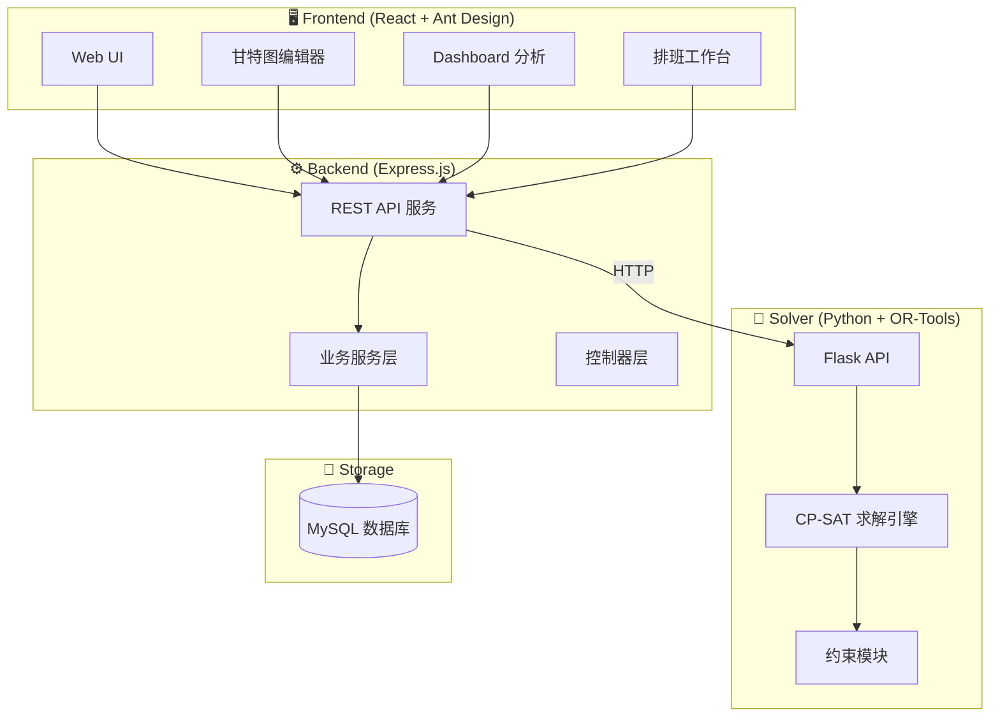
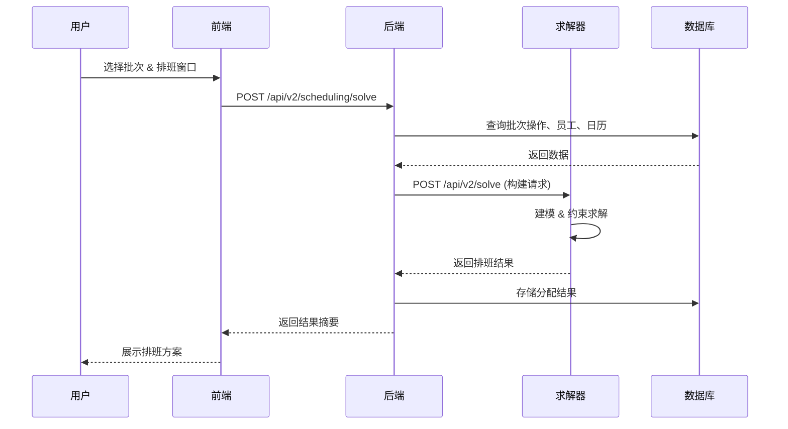
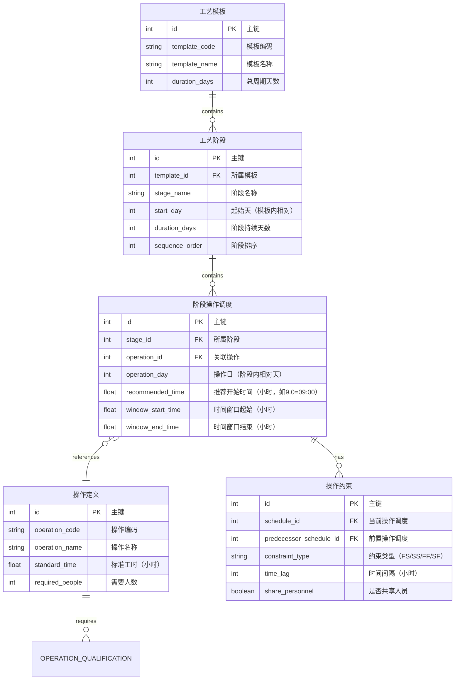
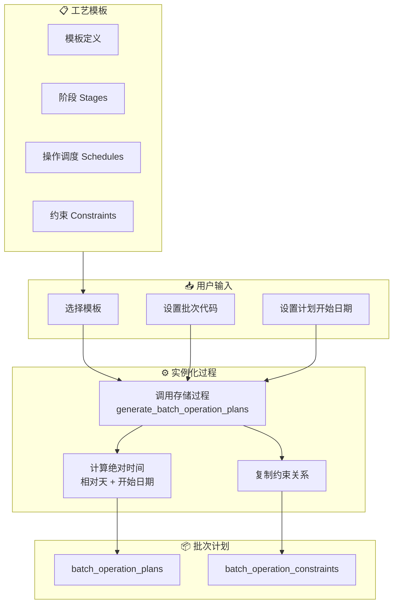
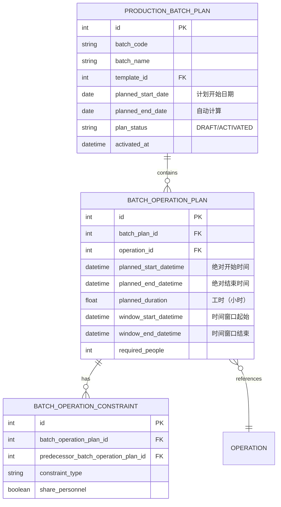
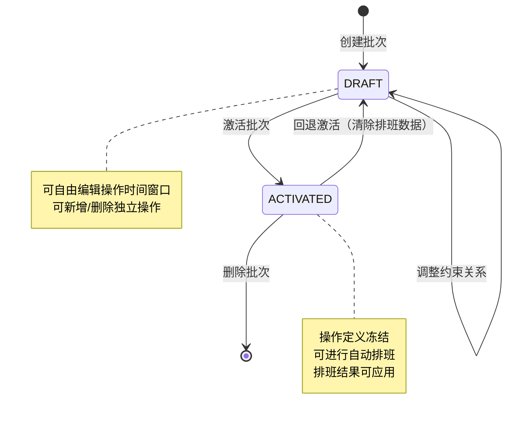
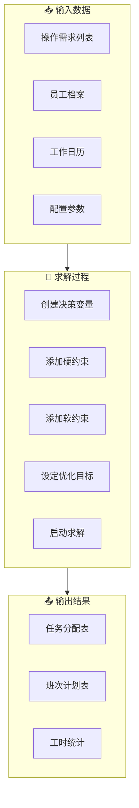
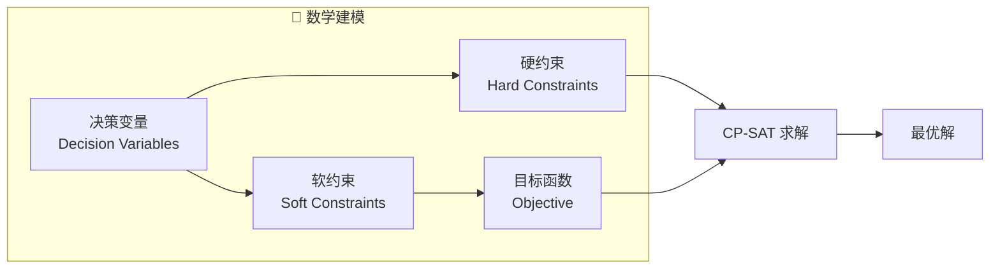
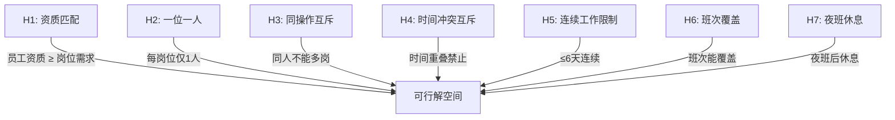
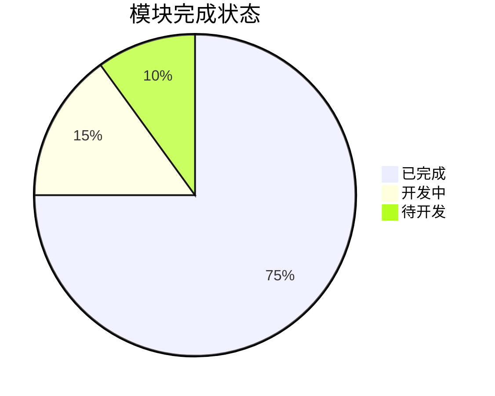

# CCAPS22 - 生物制药工艺排班系统

> **Cell Culture / Advanced Process Scheduling** - 药明生物 USP（上游工艺）智能排班系统

## 🎯 项目概述

本系统是一个面向生物制药上游工艺（USP）的智能人员排班解决方案，专为细胞培养车间班组设计。系统基于 OR-Tools CP-SAT 约束求解器，实现工艺流程驱动的自动排班，兼顾资质匹配、工时合规、员工体验等多维度优化目标。

### 核心能力

- **🔬 工艺驱动排班**：基于标准流程模板（Process Template）生成批次（Batch）计划，自动推导操作时序和人员需求
- **🧩 约束求解引擎**：12 个模块化约束（资质、工时、班次、公平性等），支持硬约束强制 + 软约束优化
- **📊 可视化调度台**：甘特图批次管理、拖拽编辑、约束校验、分段求解
- **📈 Dashboard 分析**：人力供需曲线、工时分布、每日任务看板

---

## 🏗️ 系统架构

### 整体架构图



### 数据流程图



---

## 📋 业务流程说明

### 核心业务流程


### 1. 工艺流程模板建模

工艺流程模板是批次计划的蓝图，定义了标准工艺的操作序列、时间参数和约束关系。

#### 1.1 模板数据模型



#### 1.2 时间参数说明

| 参数 | 含义 | 示例 |
|-----|------|------|
| `stage.start_day` | 阶段在模板中的起始天（Day 0/1/2...） | 细胞复苏从 Day 0 开始 |
| `schedule.operation_day` | 操作在阶段内的相对天 | 第 2 天执行接种操作 |
| `schedule.recommended_time` | 推荐开始时间（24h 制，小时） | 9.0 = 09:00 |
| `schedule.window_start/end` | 可执行时间窗口 | 8.0 ~ 18.0 = 08:00-18:00 |
| `operation.standard_time` | 操作标准耗时（小时） | 3.0 = 3 小时 |

#### 1.3 约束类型

| 类型 | 全称 | 含义 |
|-----|------|------|
| **FS** | Finish-to-Start | 前操作完成后才能开始后操作 |
| **SS** | Start-to-Start | 前后操作同时或间隔启动 |
| **FF** | Finish-to-Finish | 前后操作同时或间隔结束 |
| **SF** | Start-to-Finish | 前操作开始后后操作才能结束 |

---

### 2. 批次实例化流程

从工艺模板创建批次时，系统自动将相对时间转换为绝对日期时间。

#### 2.1 实例化流程图



#### 2.2 时间计算公式

```
批次操作开始时间 = 批次计划开始日期 
                    + (阶段起始天 + 操作相对天 - 最小天偏移)
                    + 推荐开始时间

批次操作结束时间 = 批次操作开始时间 + 操作标准工时
```

**计算示例**：

```
批次计划开始日期: 2025-01-01

模板定义:
  - 阶段"接种" start_day=0
  - 操作"细胞接种" operation_day=2, recommended_time=9.0, standard_time=3.0

计算:
  绝对日期 = 2025-01-01 + (0 + 2 - 0) = 2025-01-03
  开始时间 = 2025-01-03 09:00
  结束时间 = 2025-01-03 12:00 (09:00 + 3小时)
```

#### 2.3 批次数据模型



#### 2.4 批次状态生命周期



**状态说明**：
| 状态 | 可编辑内容 | 排班功能 |
|-----|----------|---------|
| **DRAFT** | 操作时间、约束关系、人数需求 | ❌ 不可排班 |
| **ACTIVATED** | 仅可编辑未来日期的操作 | ✅ 可自动排班 |

### 3. 智能排班流程



### 4. 排班原则

> 来自 `docs/scheduling_principles.md`

#### 工时约束
- **季度工时**：必须 ≥ 季度标准工时
- **月度工时**：标准工时 ±16 小时容差（可配置）

#### 夜班管理
- 夜班判定：开始时间 ≥ 19:00 或跨夜超过 11 小时
- 夜班后强制休息 ≥ 2 天

#### 补班策略
- 普通周末可安排补班（2x 工资）
- 法定节假日（3x 工资）需单独管控

#### 休息日管理
- 休息日尽量连续，避免碎片化
- 夜班后优先连续两天休息

---

## 🧮 求解器建模详解

本节详细说明求解器如何将排班问题转化为数学模型。

### 1. 数学建模概述

排班问题被建模为**约束满足优化问题（CSP + Optimization）**，使用 Google OR-Tools 的 **CP-SAT（Constraint Programming - SAT）** 求解器处理。



### 2. 决策变量（Decision Variables）

#### 2.1 核心分配变量

| 变量名 | 类型 | 定义 | 说明 |
|-------|------|------|------|
| `assign[op, pos, emp]` | 布尔 | 员工 `emp` 是否被分配到操作 `op` 的岗位 `pos` | 核心决策变量 |
| `assign[op, emp]` | 布尔 | 员工 `emp` 是否被分配到操作 `op` 的**任意岗位** | 聚合变量，用于约束 |

**变量创建示例**：
```
操作 OP-001 需要 2 人（岗位1、岗位2）
候选员工：张三、李四、王五

创建变量：
  assign[OP-001, 1, 张三] ∈ {0, 1}  # 张三是否分配到岗位1
  assign[OP-001, 1, 李四] ∈ {0, 1}
  assign[OP-001, 1, 王五] ∈ {0, 1}
  assign[OP-001, 2, 张三] ∈ {0, 1}
  assign[OP-001, 2, 李四] ∈ {0, 1}
  assign[OP-001, 2, 王五] ∈ {0, 1}
  
聚合变量：
  assign[OP-001, 张三] = max(岗位1变量, 岗位2变量)
```

#### 2.2 班次与工时变量

| 变量名 | 类型 | 定义 |
|-------|------|------|
| `day_has_work[emp, date]` | 布尔 | 员工当天是否有工作 |
| `day_is_night[emp, date]` | 布尔 | 员工当天是否为夜班 |
| `day_minutes[emp, date]` | 整数 | 员工当天工作分钟数 |
| `month_minutes[emp, month]` | 整数 | 员工当月累计工作分钟数 |

#### 2.3 惩罚与松弛变量

| 变量名 | 用途 |
|-------|------|
| `slack[op, pos]` | 岗位缺员松弛（允许人手不足） |
| `skip[op, pos]` | 岗位跳过变量（用于分层求解统计） |
| `penalty_*` | 各类软约束惩罚项 |

### 3. 约束体系（Constraints）

#### 3.1 硬约束（必须满足）



**约束数学表达**：

| 约束 | 数学表达式 | 含义 |
|-----|-----------|------|
| **H1** | `emp.qualification[q] >= op.required_level[q]` | 只有资质达标才能分配 |
| **H2** | `Σ assign[op,pos,*] + slack[op,pos] = 1` | 每岗位分配1人或缺员 |
| **H3** | `Σ assign[op,*,emp] ≤ 1` ∀ emp | 同人在同操作最多1个岗位 |
| **H4** | `assign[opA,empX] + assign[opB,empX] ≤ 1` | 时间重叠操作互斥（当 opA ∩ opB ≠ ∅） |
| **H5** | `Σ day_has_work[emp,d:d+6] ≤ 6` | 任意7天窗口最多工作6天 |
| **H7** | `day_is_night[emp,d] → ¬day_has_work[emp,d+1]` | 夜班后第1天必须休息 |

#### 3.2 软约束（尽可能满足）

| 约束 | 惩罚权重 | 说明 |
|-----|---------|------|
| **S1: 缺员惩罚** | 1000/岗位 | 无法分配时的松弛代价 |
| **S2: 共享人员** | 100/人 | 共享组内未复用同一人 |
| **S3: 夜班休息第2天** | 50 | 夜班后第2天未休息 |
| **S4: 三倍工资日** | 200/人·天 | 法定节假日排班 |
| **S5: 公平性偏差** | 10/小时 | 工时分布不均 |

### 4. 目标函数（Objective Function）

```
Minimize:  Σ (缺员惩罚) 
         + Σ (共享违规惩罚)
         + Σ (夜班休息违规)
         + Σ (三倍工资日人次 × 权重)
         + Σ (公平性偏差 × 权重)
         + Σ (出勤天数)  // 鼓励集中工作
```

### 5. 预处理优化

为提升求解效率，系统在建模前进行以下预处理：

| 优化技术 | 说明 | 效果 |
|---------|------|------|
| **候选人预过滤** | 按资质、不可用时段过滤无效候选 | 减少变量数量 50%+ |
| **区间索引建立** | 按日期分组操作，按开始时间排序 | O(n²)→O(n log n) 冲突检测 |
| **重叠对预计算** | 扫描线算法预计算所有重叠操作对 | 避免运行时重复计算 |
| **锁定冲突跳过** | 与锁定操作冲突的分配直接跳过 | 减少无效变量创建 |

### 6. 求解策略

#### 6.1 分段求解（>14天自动启用）

长周期排班自动拆分为多个子问题：

```
整体窗口: 2025-01-01 ~ 2025-02-28 (59天)
    ↓ 拆分为
子问题1: 2025-01-01 ~ 2025-01-14 (14天)
子问题2: 2025-01-15 ~ 2025-01-28 (14天)
子问题3: 2025-01-29 ~ 2025-02-11 (14天)
子问题4: 2025-02-12 ~ 2025-02-28 (17天)
    ↓ 逐段求解，结果合并
```

#### 6.2 层次化求解（预留）

优先级分层：先满足高优先级操作，再处理低优先级。

### 7. 结果输出

| 输出项 | 内容 |
|-------|------|
| `assignments` | 操作-员工分配表 |
| `shift_plans` | 员工每日班次计划 |
| `hours_summaries` | 员工月度工时汇总 |
| `diagnostics` | 求解统计（用时、解数、目标值） |
| `warnings` | 跳过的操作及原因 |

---

## 📊 模块开发进度

### 整体完成状态



### 详细模块进度

| 模块 | 子模块 | 状态 | 完成度 | 备注 |
|------|-------|------|--------|------|
| **Frontend** ||||
| │ | 工艺模板管理 | ✅ 已完成 | 100% | 含甘特图编辑 |
| │ | 批次管理 | ✅ 已完成 | 100% | 含拖拽编辑、约束可视化 |
| │ | 排班工作台 | ✅ 已完成 | 100% | V2 模块化版本 |
| │ | 组织架构管理 | ✅ 已完成 | 100% | 树形结构 + 人员分配 |
| │ | 资质矩阵 | ✅ 已完成 | 100% | 员工-操作资质管理 |
| │ | Dashboard | ✅ 已完成 | 95% | 人力曲线、工时分布 |
| │ | 人员日历 | ✅ 已完成 | 90% | 班次视图、操作分配 |
| │ | 系统设置 | ✅ 已完成 | 90% | 工时标准、节假日配置 |
| **Backend** ||||
| │ | 批次生命周期 | ✅ 已完成 | 100% | DRAFT → ACTIVATED |
| │ | V2 排班 API | ✅ 已完成 | 100% | 含分段求解支持 |
| │ | 约束校验服务 | ✅ 已完成 | 100% | 前端实时验证 |
| │ | 日历服务 | ✅ 已完成 | 100% | 节假日 + 薪资倍率 |
| │ | Dashboard API | ✅ 已完成 | 95% | 人力供需、每日任务 |
| │ | 数据库备份 | ✅ 已完成 | 100% | mysqldump 导出 |
| **Solver** ||||
| │ | 核心求解引擎 | ✅ 已完成 | 100% | CP-SAT 模块化 |
| │ | 分段求解器 | ✅ 已完成 | 100% | >14天自动启用 |
| │ | 操作分配约束 | ✅ 已完成 | 100% | 资质、人数、时间 |
| │ | 工时约束 | ✅ 已完成 | 100% | 月度/季度 |
| │ | 夜班休息约束 | ✅ 已完成 | 100% | 硬+软约束 |
| │ | 公平性约束 | ✅ 已完成 | 90% | 周末、夜班分布 |
| │ | 约束冲突检测 | ✅ 已完成 | 100% | 预检不可行 |
| │ | 主管在场约束 | 🔄 开发中 | 70% | 每班次至少1名主管 |
| │ | 员工体验优化 | 🔄 开发中 | 60% | 疲劳追踪、稳定性 |
| **Database** ||||
| │ | 核心表结构 | ✅ 已完成 | 100% | 30+ 表 |
| │ | 迁移脚本 | ✅ 已完成 | 100% | 版本化迁移 |

### 图例说明
- ✅ **已完成**：功能稳定，可用于生产
- 🔄 **开发中**：功能可用，持续优化
- ⏳ **待开发**：已规划，尚未开始

---

## 📦 项目结构

```
ccaps22/
├── frontend/          # React + Ant Design 前端应用
├── backend/           # Express.js + TypeScript API 服务
├── solver/            # Python OR-Tools CP-SAT 求解器
├── database/          # MySQL 数据库脚本与迁移
├── admin/             # Vite React 管理后台（独立应用）
├── docs/              # 设计文档、API 说明
├── archive/           # 历史版本与备份
├── start.sh           # 一键启动脚本
└── AGENTS.md          # AI Agent 开发指南
```

---

## 🖥️ 模块详细说明

### 1. Frontend - 前端应用

**技术栈**：React 18 + TypeScript + Ant Design 5.x

#### 1.1 页面模块 (`frontend/src/pages/`)

| 页面文件 | 功能描述 |
|---------|---------|
| `AutoSchedulingPage.tsx` | 自动排班入口页 |
| `BatchManagementPage.tsx` | 批次管理与甘特图编辑 |
| `ProcessTemplatesPage.tsx` | 工艺流程模板管理 |
| `ModularSchedulingPage.tsx` | 模块化排班工作台 |
| `QualificationMatrixPage.tsx` | 员工-操作资质矩阵 |
| `OrganizationWorkbenchPage.tsx` | 组织架构与人员管理 |
| `PersonnelSchedulingPage.tsx` | 人员日程日历视图 |
| `ShiftDefinitionsPage.tsx` | 班次定义管理 |
| `SystemSettingsPage.tsx` | 系统设置（工时标准、节假日配置等） |
| `SystemMonitorPage.tsx` | 系统监控与日志 |

#### 1.2 核心组件 (`frontend/src/components/`)

**甘特图组件**
- `ProcessTemplateGantt/` - 工艺流程模板甘特图编辑器
  - `index.tsx` - 主组件，支持拖拽编辑、约束可视化
  - `hooks/` - `useGanttData`, `useGanttDrag`, `useTimeBlocks` 等
  - `components/` - `GanttBars`, `GanttHeader`, `TimeWindowHandle`
- `BatchGanttAdapter/` - 批次甘特图适配器，桥接模板与批次实例
- `ActivatedBatchGantt.tsx` - 已激活批次只读甘特图

**排班工作台**
- `ModularScheduling/`
  - `index.tsx` - 模块化排班主界面
  - `BatchSelector.tsx` - 批次多选器
  - `SchedulingWindow.tsx` - 排班窗口选择
  - `SolveProgress.tsx` - 求解进度展示
  - `SolveResultModal.tsx` - 求解结果弹窗
  - `tabs/` - 分析标签页（约束冲突、分配结果等）

**Dashboard 组件**
- `Dashboard/`
  - `ManpowerCurveCard.tsx` - 人力供需曲线图（按日期/班次堆叠）
  - `WorkHoursCurveCard.tsx` - 工时分布曲线图
  - `DailyAssignmentsPanel.tsx` - 每日任务分配面板

**其他核心组件**
- `OrganizationWorkbench.tsx` - 组织架构树 + 人员表格
- `PersonnelCalendar.tsx` - 人员日历（班次、操作分配）
- `QualificationMatrix.tsx` - 资质矩阵编辑
- `EmployeeTable.tsx` / `EmployeeQualificationModal.tsx` - 员工管理
- `OperationTable.tsx` / `OperationQualificationModal.tsx` - 操作管理

---

### 2. Backend - API 服务

**技术栈**：Node.js + Express.js + TypeScript + MySQL

#### 2.1 控制器 (`backend/src/controllers/`)

| 控制器 | 职责说明 |
|-------|---------|
| **排班核心** ||
| `schedulingV2Controller.ts` | V2 排班 API（调用 Python Solver） |
| `personnelScheduleController.ts` | 人员日程 CRUD |
| `schedulingRunController.ts` | 排班运行记录管理 |
| **批次与工艺** ||
| `batchPlanningController.ts` | 批次计划（创建、激活、查询） |
| `processTemplateController.ts` | 工艺流程模板 |
| `processStageController.ts` | 工艺阶段管理 |
| `stageOperationController.ts` | 阶段内操作定义 |
| `independentOperationController.ts` | 独立操作（非模板关联） |
| **约束与资质** ||
| `constraintController.ts` | 约束关系管理（前后依赖、共享组等） |
| `shareGroupController.ts` | 人员共享组 |
| `qualificationController.ts` | 资质定义 |
| `operationQualificationController.ts` | 操作-资质需求 |
| `employeeQualificationController.ts` | 员工-资质关联 |
| `qualificationMatrixController.ts` | 资质矩阵视图 |
| **人员与组织** ||
| `employeeController.ts` | 员工 CRUD |
| `organizationController.ts` | 组织架构 |
| `lockController.ts` | 人员锁定（请假、不可排班） |
| **日历与班次** ||
| `calendarController.ts` | 工作日历（节假日、调休） |
| `shiftDefinitionController.ts` | 班次定义 |
| `shiftTypeController.ts` | 班次类型 |
| **系统管理** ||
| `dashboardController.ts` | Dashboard 数据接口 |
| `systemController.ts` | 系统设置 |
| `databaseController.ts` | 数据库导出/备份 |

#### 2.2 服务层 (`backend/src/services/`)

| 服务 | 职责说明 |
|-----|---------|
| `schedulingV2/` | V2 排班服务（请求构建、结果解析、持久化） |
| `batchLifecycleService.ts` | 批次生命周期（DRAFT → ACTIVATED） |
| `constraintValidationService.ts` | 约束校验（前端实时验证） |
| `templateSchedulingService.ts` | 模板级排班数据准备 |
| `holidayService.ts` | 节假日与调休逻辑 |
| `holidaySalaryConfigService.ts` | 节假日薪资倍率配置 |
| `standardHoursService.ts` | 标准工时计算 |
| `shiftService.ts` | 班次匹配与推荐 |
| `calendarService.ts` | 日历工具服务 |
| `organizationHierarchyService.ts` | 组织层级树 |
| `solverProgressService.ts` | 求解进度推送（SSE） |

---

### 3. Solver - 求解器服务

**技术栈**：Python 3.11 + Flask + Google OR-Tools CP-SAT

#### 3.1 目录结构

```
solver/
├── app.py                    # Flask 入口（/api/v2/solve）
├── contracts/                # 请求/响应数据契约
│   ├── request.py            # SolverRequest 定义
│   └── response.py           # SolverResponse 定义
├── models/
│   ├── context.py            # SolverContext（全局上下文）
│   └── variables.py          # CP-SAT 变量容器
├── core/
│   ├── solver.py             # 主求解器逻辑
│   ├── segmented_solver.py   # 分段求解器（>14天自动启用）
│   ├── hierarchical_solver.py # 层次化求解（预留）
│   ├── result_builder.py     # 结果构建
│   └── conflict_detector.py  # 约束冲突检测
├── constraints/              # 约束模块
│   ├── operation_assignment.py  # 操作分配核心约束
│   ├── shift_consistency.py     # 班次一致性
│   ├── monthly_hours.py         # 月度/季度工时
│   ├── consecutive_work.py      # 连续工作天数限制
│   ├── night_rest.py            # 夜班休息约束
│   ├── qualification.py         # 资质匹配
│   ├── sharing.py               # 共享组约束
│   ├── fairness.py              # 公平性约束（周末、夜班分布）
│   ├── supervisor.py            # 主管在场约束
│   └── decision_strategy.py     # 搜索策略
└── objectives/
    └── builder.py            # 目标函数构建器
```

#### 3.2 约束模块详解

| 约束名称 | 类型 | 说明 |
|---------|-----|------|
| **operation_assignment** | 硬 | 每个操作需求必须分配足够人员 |
| **qualification** | 硬 | 员工必须持有操作所需资质 |
| **consecutive_work** | 硬 | 连续工作 ≤ N 天（默认 6 天） |
| **night_rest** | 硬/软 | 夜班后第 1 天强制休息，第 2 天尽量休息 |
| **monthly_hours** | 硬 | 月度工时在标准工时 ±16 小时范围 |
| **shift_consistency** | 软 | 同一天尽量只上一种班次 |
| **sharing** | 软 | 共享组内优先使用相同人员 |
| **fairness** | 软 | 周末/节假日班次公平分配 |
| **supervisor** | 软 | 每个班次至少一名主管在场 |

#### 3.3 API 端点

| 端点 | 方法 | 说明 |
|-----|------|------|
| `/api/health` | GET | 健康检查 |
| `/api/v2/solve` | POST | 执行排班求解 |
| `/api/v2/validate` | POST | 请求数据校验 |

---

### 4. Database - 数据库

**数据库**：MySQL 8.0

#### 4.1 核心表结构

**人员与组织**
- `employees` - 员工基本信息
- `organizations` - 组织架构
- `employee_qualifications` - 员工资质关联

**工艺流程**
- `process_templates` - 工艺流程模板
- `process_stages` - 工艺阶段
- `stage_operations` - 阶段内操作定义
- `operation_qualifications` - 操作资质需求

**批次计划**
- `batch_plans` - 批次计划
- `batch_operations` - 批次操作实例
- `batch_constraints` - 批次约束关系

**排班结果**
- `personnel_schedules` - 人员日程
- `operation_assignments` - 操作-人员分配
- `scheduling_runs` - 排班运行记录

**日历与班次**
- `calendar_workdays` - 工作日历
- `shift_definitions` - 班次定义
- `shift_types` - 班次类型

**约束配置**
- `constraint_relationships` - 约束关系定义
- `share_groups` - 人员共享组
- `independent_operations` - 独立操作

#### 4.2 迁移脚本 (`database/migrations/`)

按顺序执行迁移脚本以初始化或升级数据库。

---

### 5. Admin - 管理后台

**技术栈**：Vite + React + TypeScript

独立的轻量级管理后台应用，用于：
- 系统参数配置
- 数据导入导出
- 日志查看与监控

---

## 🚀 快速开始

### 环境要求

- Node.js >= 18.x
- Python >= 3.11
- MySQL >= 8.0
- pnpm / npm

### 安装与启动

```bash
# 1. 克隆仓库
git clone <repo-url>
cd ccaps22

# 2. 安装后端依赖
cd backend && npm install

# 3. 安装前端依赖
cd ../frontend && npm install

# 4. 安装求解器依赖
cd ../solver
python -m venv .venv
source .venv/bin/activate
pip install -r requirements.txt

# 5. 配置数据库
# 创建 MySQL 数据库并执行 database/ 下的初始化脚本

# 6. 配置环境变量
cp backend/.env.sample backend/.env
# 编辑 .env 配置数据库连接

# 7. 一键启动（推荐）
./start.sh

# 或分别启动
cd backend && npm run dev      # API: http://localhost:3001
cd frontend && npm start       # UI: http://localhost:3000
cd solver && python app.py     # Solver: http://localhost:5001
```

---

## 📋 开发规范

请参阅 [AGENTS.md](./AGENTS.md) 了解：
- 代码风格与命名规范
- Git 提交规范
- 测试指南
- 安全注意事项

---

## 📖 相关文档

| 文档 | 说明 |
|-----|------|
| `docs/SCHEDULING_API_V2.md` | V2 排班 API 详细规范 |
| `docs/scheduling_principles.md` | 排班原则与业务规则 |
| `docs/constraint_conflict_analysis.md` | 约束冲突分析 |
| `solver/README.md` | 求解器详细说明 |
| `solver/REQUIREMENTS.md` | 求解器需求文档 |

---

## 🔄 版本历史

- **v2.0** - 模块化求解器重构，分段求解支持，Dashboard 增强
- **v1.0** - 初始版本，基础排班功能

---

## 📞 联系方式

如有问题请联系项目负责人。

---

*本系统专为药明生物 USP 车间设计，持续优化中。*
