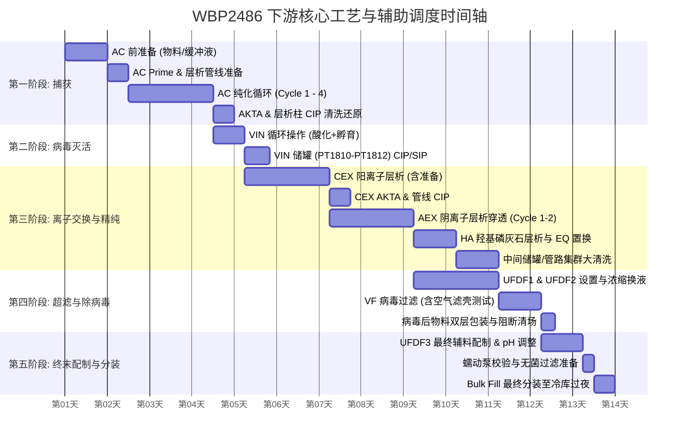

# WBP2486 下游工艺 (DSP) 深度时间线与流程梳理

根据项目内嵌的运营数据提取，WBP2486 的下游纯化 (Downstream Process) 是一套高度串联的生物制药纯化工艺。由于底层 `standard_time` 模板被批量初始化（默认 12h），其实际调度价值在于其严格的**工序先后依赖（Sequence Dependency）**与**辅助活动并行性**。

以下是对其时间轴流转的深度梳理与时序建模。

## 📅 下游工艺全局时间线 (DSP Timeline Gantt)

下游工艺在真实车间调度中不是单纯的单线任务，而是交织着主工艺 (Main Process)、设备清洗灭菌 (CIP/SIP) 以及物料准备 (Preparation) 的多轨并行时间线。

---

## ⏱️ 关键瓶颈与依赖链路解析 (Critical Path Analysis)

如果进一步下钻到微观的时序排列，在上述宏观流转下隐藏着几条不可避开的**刚性时间锁 (Time Locks)**，这是导致车间排产拥堵的核心：

### 1. 并发资源抢占瓶颈 (CIP/WFI 冲突)
在 `AEX` 阶段即将结束跨入 `HA` 之前，上游的 `AC` 和 `VIN` 留下了大量的脏储罐 (Dirty Hold) 亟待清洗：
- `PT1810-PT1812 SIP`
- `U1850-T1810 CIP`
- `T1813 Bypass CIP` 等动作。
这些动作在时间轴上会密集触发，如果此时车间的 WFI (注射用水) 回路制备能力不足，或者 CIP 撬台被占用，将直接卡死后续 UFDF 的物料转移时间线。

### 2. 物料传递与人工前置等待锁 (M-Transfer Lock)
在时间轴上，每一个工艺阶段的起始点并非设备开机，而是人工校验：
- “**BOM 物料传递**” 和 “**一次性溶液检查无渗漏**”。
比如 UFDF2 开始前，必须要有空 Tank 就位，如果 `Room 1219&1218 Post PPQ6 放行` 没有完成并物理推到车间，设备会无限期闲置（Idle），这是严重拖慢进度的时间漏洞。

### 3. 取样快检时间的挤占 (Sampling Hold)
- `CEX AKTA CIP+sample（立检；14点前送样）`
- `UFDF3 辅料配制 & pH Adustment （HPLC浓度立检）`
这些立检操作引入了外部依赖（QC/QA 实验室的响应时间），导致了时间线上的强制断档点 (Hold Point)。在模型映射中，需将这块视为一段概率性时长进行缓冲预留。

## 🎯 总结
这套时间的拆解不仅仅体现了先后顺序，更展示了 **主设备运行时段**、**前后辅助准备** 与 **清洗恢复** 在时序上形成的“三明治”夹层结构。理解这条时间线，才能为系统真正注入智能派工的灵魂。
