# 数据库架构图与字段说明（直连数据库生成）

> 说明（2026-03-25）：这是数据库结构快照，不是当前 MVP 运行面的权威说明。
> 表和字段关系可用于查 schema，但文中的“引用样例文件”可能仍包含已退役或未挂载模块。
> 判断当前活跃运行面，请以 `frontend/src/App.tsx`、`backend/src/server.ts` 和 `docs/exec-plans/active/mvp-scope-cleanup.md` 为准。

- 生成时间: 2026-03-24T09:04:49.730Z
- 数据库: aps_system @ localhost:3306
- 结构来源: `INFORMATION_SCHEMA`（真实库）
- “是否正在被使用”判定: 在 `backend/src` 非测试代码中命中表名；字段在该表命中文件中命中字段名。
- 注意: “正在被使用”是静态代码命中，不代表运行时 100% 覆盖。

## 架构图（在用表）

```mermaid
erDiagram
    batch_operation_plans ||--o{ batch_operation_constraints : "batch_operation_plan_id"
    batch_operation_plans ||--o{ batch_operation_constraints : "predecessor_batch_operation_plan_id"
    batch_operation_plans ||--o{ batch_operation_resource_requirements : "batch_operation_plan_id"
    batch_operation_plans ||--o{ batch_personnel_assignments : "batch_operation_plan_id"
    batch_operation_plans ||--o{ batch_share_group_members : "batch_operation_plan_id"
    batch_operation_plans ||--o{ employee_shift_plans : "batch_operation_plan_id"
    batch_operation_plans ||--o{ overtime_records : "related_operation_plan_id"
    batch_operation_plans ||--o{ resource_assignments : "batch_operation_plan_id"
    batch_operation_resource_requirements ||--o{ batch_operation_resource_candidates : "requirement_id"
    batch_share_groups ||--o{ batch_share_group_members : "group_id"
    employee_roles ||--o{ employees : "primary_role_id"
    employee_shift_plans ||--o{ batch_personnel_assignments : "shift_plan_id"
    employee_shift_plans ||--o{ overtime_records : "related_shift_plan_id"
    employee_shift_plans ||--o{ shift_change_logs : "shift_plan_id"
    employee_shift_plans ||--o{ special_shift_occurrence_assignments : "shift_plan_id"
    employees ||--o{ batch_operation_plans : "locked_by"
    employees ||--o{ batch_personnel_assignments : "employee_id"
    employees ||--o{ employee_qualifications : "employee_id"
    employees ||--o{ employee_reporting_relations : "leader_id"
    employees ||--o{ employee_reporting_relations : "subordinate_id"
    employees ||--o{ employee_shift_limits : "employee_id"
    employees ||--o{ employee_shift_plans : "created_by"
    employees ||--o{ employee_shift_plans : "employee_id"
    employees ||--o{ employee_shift_plans : "locked_by"
    employees ||--o{ employee_shift_plans : "updated_by"
    employees ||--o{ employee_unavailability : "created_by"
    employees ||--o{ employee_unavailability : "employee_id"
    employees ||--o{ overtime_records : "approval_user_id"
    employees ||--o{ overtime_records : "created_by"
    employees ||--o{ overtime_records : "employee_id"
    employees ||--o{ shift_change_logs : "approved_by"
    employees ||--o{ shift_change_logs : "changed_by"
    employees ||--o{ shift_definitions : "created_by"
    employees ||--o{ special_shift_occurrence_assignments : "employee_id"
    employees ||--o{ special_shift_window_employee_scopes : "employee_id"
    employees ||--o{ special_shift_windows : "created_by"
    employees ||--o{ special_shift_windows : "updated_by"
    operation_resource_requirements ||--o{ operation_resource_candidates : "requirement_id"
    operation_types ||--o{ operations : "operation_type_id"
    operations ||--o{ batch_operation_plans : "operation_id"
    operations ||--o{ operation_qualification_requirements : "operation_id"
    operations ||--o{ operation_resource_requirements : "operation_id"
    operations ||--o{ stage_operation_schedules : "operation_id"
    organization_units ||--o{ employees : "unit_id"
    organization_units ||--o{ operation_types : "team_id"
    organization_units ||--o{ organization_units : "parent_id"
    organization_units ||--o{ process_templates : "team_id"
    organization_units ||--o{ resources : "owner_org_unit_id"
    organization_units ||--o{ special_shift_windows : "org_unit_id"
    personnel_share_groups ||--o{ batch_share_groups : "template_group_id"
    personnel_share_groups ||--o{ operation_share_group_relations : "share_group_id"
    personnel_share_groups ||--o{ personnel_share_group_members : "group_id"
    process_stages ||--o{ stage_operation_schedules : "stage_id"
    process_templates ||--o{ personnel_share_groups : "template_id"
    process_templates ||--o{ process_stages : "template_id"
    process_templates ||--o{ production_batch_plans : "template_id"
    production_batch_plans ||--o{ batch_operation_constraints : "batch_plan_id"
    production_batch_plans ||--o{ batch_operation_plans : "batch_plan_id"
    production_batch_plans ||--o{ batch_share_groups : "batch_plan_id"
    production_batch_plans ||--o{ project_batch_relations : "batch_plan_id"
    project_plans ||--o{ project_batch_relations : "project_plan_id"
    qualifications ||--o{ employee_qualifications : "qualification_id"
    qualifications ||--o{ operation_qualification_requirements : "qualification_id"
    qualifications ||--o{ special_shift_occurrences : "qualification_id"
    qualifications ||--o{ special_shift_window_rules : "qualification_id"
    resource_nodes ||--o{ resource_node_relations : "source_node_id"
    resource_nodes ||--o{ resource_node_relations : "target_node_id"
    resource_nodes ||--o{ resource_nodes : "parent_id"
    resource_nodes ||--o{ template_stage_operation_resource_bindings : "resource_node_id"
    resources ||--o{ batch_operation_resource_candidates : "resource_id"
    resources ||--o{ maintenance_windows : "resource_id"
    resources ||--o{ operation_resource_candidates : "resource_id"
    resources ||--o{ resource_assignments : "resource_id"
    resources ||--o{ resource_calendars : "resource_id"
    resources ||--o{ resource_nodes : "bound_resource_id"
    resources ||--o{ template_operation_resource_candidates : "resource_id"
    scheduling_runs ||--o{ batch_personnel_assignments : "scheduling_run_id"
    scheduling_runs ||--o{ employee_shift_plans : "scheduling_run_id"
    scheduling_runs ||--o{ scheduling_results : "run_id"
    scheduling_runs ||--o{ scheduling_run_batches : "run_id"
    scheduling_runs ||--o{ scheduling_run_events : "run_id"
    scheduling_runs ||--o{ special_shift_occurrence_assignments : "scheduling_run_id"
    scheduling_runs ||--o{ special_shift_occurrences : "scheduling_run_id"
    shift_definitions ||--o{ batch_personnel_assignments : "shift_code"
    shift_definitions ||--o{ employee_shift_plans : "shift_id"
    shift_definitions ||--o{ special_shift_occurrences : "shift_id"
    shift_definitions ||--o{ special_shift_window_rules : "shift_id"
    special_shift_occurrences ||--o{ special_shift_occurrence_assignments : "occurrence_id"
    special_shift_window_rules ||--o{ special_shift_occurrences : "rule_id"
    special_shift_window_rules ||--o{ special_shift_window_employee_scopes : "rule_id"
    special_shift_windows ||--o{ special_shift_occurrences : "window_id"
    special_shift_windows ||--o{ special_shift_window_rules : "window_id"
    stage_operation_schedules ||--o{ batch_operation_plans : "template_schedule_id"
    stage_operation_schedules ||--o{ operation_constraints : "predecessor_schedule_id"
    stage_operation_schedules ||--o{ operation_constraints : "schedule_id"
    stage_operation_schedules ||--o{ operation_share_group_relations : "schedule_id"
    stage_operation_schedules ||--o{ personnel_share_group_members : "schedule_id"
    stage_operation_schedules ||--o{ template_operation_resource_requirements : "template_schedule_id"
    stage_operation_schedules ||--o{ template_stage_operation_resource_bindings : "template_schedule_id"
    standalone_tasks ||--o{ resource_assignments : "standalone_task_id"
    standalone_tasks ||--o{ standalone_task_assignments : "task_id"
    standalone_tasks ||--o{ standalone_task_qualifications : "task_id"
    template_operation_resource_requirements ||--o{ template_operation_resource_candidates : "requirement_id"
```

## 表总览

| 表名 | 中文名 | 是否在用 | 字段数 |
|---|---|---|---:|
| batch_operation_constraints | 批次操作约束 | 是 | 14 |
| batch_operation_plans | 批次操作计划 | 是 | 19 |
| batch_operation_resource_candidates | 批次操作资源候选 | 是 | 4 |
| batch_operation_resource_requirements | 批次操作资源要求 | 是 | 13 |
| batch_personnel_assignments | 批次人员分配 | 是 | 22 |
| batch_share_group_members | 批次共享组成员 | 是 | 4 |
| batch_share_groups | 批次共享组 | 是 | 8 |
| calendar_workdays | 日历工作日 | 是 | 10 |
| employee_org_membership | 员工组织成员关系 | 否 | 10 |
| employee_qualifications | 员工资质 | 是 | 4 |
| employee_reporting_relations | 员工汇报关系 | 是 | 4 |
| employee_roles | 员工角色 | 是 | 9 |
| employee_shift_limits | 员工班次限制 | 是 | 15 |
| employee_shift_plans | 员工班次计划 | 是 | 21 |
| employee_unavailability | 员工不可用 | 是 | 11 |
| employees | 员工 | 是 | 12 |
| holiday_salary_config | 节假日工资配置表（3倍工资/2倍工资） | 是 | 12 |
| holiday_salary_rules | 节假日工资识别规则表 | 是 | 11 |
| holiday_update_log | 节假日更新日志表 | 是 | 7 |
| maintenance_windows | 维护窗口 | 是 | 10 |
| operation_constraints | 操作约束 | 是 | 13 |
| operation_qualification_requirements | 操作资质要求 | 是 | 8 |
| operation_resource_candidates | 操作资源候选 | 是 | 4 |
| operation_resource_requirements | 操作资源要求 | 是 | 11 |
| operation_share_group_relations | 操作共享组关系 | 是 | 5 |
| operation_types | 操作类型 | 是 | 10 |
| operations | 操作 | 是 | 8 |
| organization_units | 组织单元 | 是 | 11 |
| overtime_records | 加班记录 | 是 | 14 |
| personnel_share_group_members | 共享组成员 | 是 | 4 |
| personnel_share_groups | 人员共享组 | 是 | 9 |
| process_stages | 工艺阶段 | 是 | 7 |
| process_templates | 工艺模板 | 是 | 6 |
| production_batch_plans | 生产批次计划 | 是 | 17 |
| project_batch_relations | 项目批次关系 | 是 | 4 |
| project_plans | 项目计划 | 是 | 11 |
| qualifications | 资质 | 是 | 2 |
| resource_assignments | 资源分配 | 是 | 10 |
| resource_calendars | 资源日历 | 是 | 10 |
| resource_node_relations | 资源节点关系 | 是 | 7 |
| resource_nodes | 资源节点 | 是 | 17 |
| resources | 资源 | 是 | 15 |
| scheduling_metrics_snapshots | 排程指标快照 | 否 | 10 |
| scheduling_result_diffs | 排程结果差异 | 否 | 6 |
| scheduling_results | 排程结果 | 是 | 12 |
| scheduling_run_batches | 排程运行批次 | 是 | 8 |
| scheduling_run_events | 排程运行事件 | 是 | 8 |
| scheduling_runs | 排程运行 | 是 | 25 |
| shift_change_logs | 班次变更日志 | 是 | 12 |
| shift_definitions | 班次定义 | 是 | 15 |
| special_shift_occurrence_assignments | 特殊班次发生实例分配 | 是 | 9 |
| special_shift_occurrences | 特殊班次发生实例 | 是 | 15 |
| special_shift_window_employee_scopes | 特殊班次窗口员工范围 | 是 | 5 |
| special_shift_window_rules | 特殊班次窗口规则 | 是 | 14 |
| special_shift_windows | 特殊班次窗口 | 是 | 13 |
| stage_operation_schedules | 阶段操作计划 | 是 | 11 |
| standalone_task_assignments | 独立任务分配 | 是 | 10 |
| standalone_task_qualifications | 独立任务资质要求 | 是 | 6 |
| standalone_tasks | 独立任务表(非批次) | 是 | 18 |
| system_settings | 通用系统配置 | 是 | 6 |
| template_operation_resource_candidates | 模板操作资源候选 | 是 | 4 |
| template_operation_resource_requirements | 模板操作资源要求 | 是 | 11 |
| template_stage_operation_resource_bindings | 模板阶段操作资源绑定 | 是 | 6 |

## batch_operation_constraints（批次操作约束）

- 是否在用: 是
- 引用样例文件: backend/src/controllers/batchConstraintController.ts，backend/src/controllers/batchGanttV5Controller.ts，backend/src/controllers/constraintController.ts，backend/src/controllers/independentOperationController.ts，backend/src/controllers/platformController.ts，backend/src/services/batchLifecycleService.ts，backend/src/services/batchValidationService.ts，backend/src/services/schedulingV2/dataAssembler.ts

| 字段名 | 字段中文名 | 字段类型 | 是否UQ | 是否在用 |
|---|---|---|---|---|
| id | ID | int | 否 | 是 |
| batch_plan_id | 批次计划ID | int | 否 | 是 |
| batch_operation_plan_id | 批次操作计划ID | int | 是(联合) | 是 |
| predecessor_batch_operation_plan_id | predecessor批次操作计划ID | int | 是(联合) | 是 |
| constraint_type | 约束类型 | tinyint | 否 | 是 |
| time_lag | 时间lag | decimal(4,1) | 否 | 是 |
| lag_type | lag类型 | enum('ASAP','FIXED','WINDOW','NEXT_DAY','NEXT_SHIFT','COOLING','BATCH_END') | 否 | 是 |
| lag_min | lag_min | decimal(5,1) | 否 | 是 |
| lag_max | lag_max | decimal(5,1) | 否 | 是 |
| constraint_level | 约束等级 | tinyint | 否 | 是 |
| share_personnel | 共享人员 | tinyint(1) | 否 | 是 |
| share_mode | 共享模式 | enum('NONE','SAME_TEAM','DIFFERENT') | 否 | 是 |
| constraint_name | 约束名称 | varchar(100) | 否 | 是 |
| description | description | text | 否 | 是 |

## batch_operation_plans（批次操作计划）

- 是否在用: 是
- 引用样例文件: backend/src/controllers/batchConstraintController.ts，backend/src/controllers/batchGanttV4Controller.ts，backend/src/controllers/batchGanttV5Controller.ts，backend/src/controllers/batchPlanningController.ts，backend/src/controllers/calendarController.ts，backend/src/controllers/constraintController.ts，backend/src/controllers/dashboardController.ts，backend/src/controllers/independentOperationController.ts

| 字段名 | 字段中文名 | 字段类型 | 是否UQ | 是否在用 |
|---|---|---|---|---|
| id | ID | int | 否 | 是 |
| batch_plan_id | 批次计划ID | int | 是(联合) | 是 |
| template_schedule_id | 模版操作安排ID，独立操作为NULL | int | 是(联合) | 是 |
| operation_id | 操作ID | int | 否 | 是 |
| planned_start_datetime | planned开始datetime | datetime | 否 | 是 |
| planned_end_datetime | planned结束datetime | datetime | 否 | 是 |
| planned_duration | planned_duration | decimal(5,2) | 否 | 是 |
| window_start_datetime | 窗口开始datetime | datetime | 否 | 是 |
| window_end_datetime | 窗口结束datetime | datetime | 否 | 是 |
| required_people | required_people | int | 否 | 是 |
| notes | notes | text | 否 | 是 |
| is_locked | 是否locked | tinyint(1) | 否 | 是 |
| locked_by | locked_by | int | 否 | 是 |
| locked_at | locked时间 | datetime | 否 | 是 |
| lock_reason | lock_reason | varchar(255) | 否 | 是 |
| created_at | 创建时间 | timestamp | 否 | 是 |
| updated_at | 更新时间 | timestamp | 否 | 是 |
| is_independent | 是否为独立操作 | tinyint(1) | 否 | 是 |
| generation_group_id | 批量生成组ID | varchar(36) | 否 | 是 |

## batch_operation_resource_candidates（批次操作资源候选）

- 是否在用: 是
- 引用样例文件: backend/src/services/batchResourceSnapshotService.ts，backend/src/services/templateResourceRuleService.ts

| 字段名 | 字段中文名 | 字段类型 | 是否UQ | 是否在用 |
|---|---|---|---|---|
| id | ID | int | 否 | 是 |
| requirement_id | 要求ID | int | 是(联合) | 是 |
| resource_id | 资源ID | int | 是(联合) | 是 |
| created_at | 创建时间 | datetime | 否 | 否 |

## batch_operation_resource_requirements（批次操作资源要求）

- 是否在用: 是
- 引用样例文件: backend/src/controllers/batchOperationResourceController.ts，backend/src/controllers/platformController.ts，backend/src/services/batchResourceSnapshotService.ts，backend/src/services/schedulingV4/DataAssemblerV4.ts，backend/src/services/templateResourceRuleService.ts

| 字段名 | 字段中文名 | 字段类型 | 是否UQ | 是否在用 |
|---|---|---|---|---|
| id | ID | int | 否 | 是 |
| batch_operation_plan_id | 批次操作计划ID | int | 否 | 是 |
| resource_type | 资源类型 | enum('ROOM','EQUIPMENT','VESSEL_CONTAINER','TOOLING','STERILIZATION_RESOURCE') | 否 | 是 |
| required_count | required_count | int | 否 | 是 |
| is_mandatory | 是否mandatory | tinyint(1) | 否 | 是 |
| requires_exclusive_use | requires_exclusive_use | tinyint(1) | 否 | 是 |
| prep_minutes | prep_minutes | int | 否 | 是 |
| changeover_minutes | changeover_minutes | int | 否 | 是 |
| cleanup_minutes | cleanup_minutes | int | 否 | 是 |
| source_scope | source范围 | enum('GLOBAL_DEFAULT','TEMPLATE_OVERRIDE','BATCH_OVERRIDE') | 否 | 是 |
| source_requirement_id | source要求ID | int | 否 | 是 |
| created_at | 创建时间 | datetime | 否 | 是 |
| updated_at | 更新时间 | datetime | 否 | 否 |

## batch_personnel_assignments（批次人员分配）

- 是否在用: 是
- 引用样例文件: backend/src/controllers/batchGanttV4Controller.ts，backend/src/controllers/batchGanttV5Controller.ts，backend/src/controllers/batchPlanningController.ts，backend/src/controllers/calendarController.ts，backend/src/controllers/dashboardController.ts，backend/src/controllers/personnelScheduleController.ts，backend/src/controllers/platformController.ts，backend/src/controllers/schedulingV2Controller.ts

| 字段名 | 字段中文名 | 字段类型 | 是否UQ | 是否在用 |
|---|---|---|---|---|
| id | ID | int | 否 | 是 |
| batch_operation_plan_id | 批次操作计划ID | int | 是(联合) | 是 |
| position_number | position_number | int | 是(联合) | 是 |
| scheduling_run_id | 排程运行ID | bigint unsigned | 否 | 是 |
| employee_id | 员工ID | int | 是(联合) | 是 |
| role | 角色 | enum('OPERATOR','SUPERVISOR','QC_INSPECTOR','ASSISTANT') | 否 | 是 |
| is_primary | 是否primary | tinyint(1) | 否 | 是 |
| qualification_level | 资质等级 | int | 否 | 是 |
| qualification_match_score | 资质matchscore | decimal(3,1) | 否 | 否 |
| assignment_status | 分配状态 | enum('PLANNED','CONFIRMED','CANCELLED') | 否 | 是 |
| assigned_at | assigned时间 | timestamp | 否 | 是 |
| confirmed_at | confirmed时间 | timestamp | 否 | 否 |
| notes | notes | text | 否 | 是 |
| shift_plan_id | 班次计划ID | int | 否 | 是 |
| shift_code | 班次编码 | varchar(32) | 否 | 是 |
| plan_category | 计划category | enum('PRODUCTION','OVERTIME','TEMPORARY') | 否 | 是 |
| plan_hours | 计划工时 | decimal(5,2) | 否 | 是 |
| is_overtime | 是否加班 | tinyint(1) | 否 | 是 |
| overtime_hours | 加班工时 | decimal(5,2) | 否 | 是 |
| assignment_origin | 分配origin | enum('AUTO','MANUAL','ADJUSTED') | 否 | 否 |
| last_validated_at | lastvalidated时间 | datetime | 否 | 否 |
| is_locked | 是否locked | tinyint(1) | 否 | 是 |

## batch_share_group_members（批次共享组成员）

- 是否在用: 是
- 引用样例文件: backend/src/controllers/batchGanttV5Controller.ts，backend/src/controllers/calendarController.ts，backend/src/controllers/schedulingV4Controller.ts，backend/src/controllers/shareGroupController.ts，backend/src/services/schedulingV2/dataAssembler.ts，backend/src/services/schedulingV3/dataAssemblerV3.ts，backend/src/services/schedulingV4/DataAssemblerV4.ts

| 字段名 | 字段中文名 | 字段类型 | 是否UQ | 是否在用 |
|---|---|---|---|---|
| id | ID | int | 否 | 是 |
| group_id | 组ID | int | 是(联合) | 是 |
| batch_operation_plan_id | 批次操作计划ID | int | 是(联合) | 是 |
| created_at | 创建时间 | timestamp | 否 | 是 |

## batch_share_groups（批次共享组）

- 是否在用: 是
- 引用样例文件: backend/src/controllers/batchGanttV5Controller.ts，backend/src/controllers/calendarController.ts，backend/src/controllers/schedulingV4Controller.ts，backend/src/controllers/shareGroupController.ts，backend/src/services/schedulingV2/dataAssembler.ts，backend/src/services/schedulingV3/dataAssemblerV3.ts，backend/src/services/schedulingV4/DataAssemblerV4.ts

| 字段名 | 字段中文名 | 字段类型 | 是否UQ | 是否在用 |
|---|---|---|---|---|
| id | ID | int | 否 | 是 |
| batch_plan_id | 批次计划ID | int | 否 | 是 |
| template_group_id | 模板组ID | int | 否 | 是 |
| group_code | 组编码 | varchar(50) | 否 | 是 |
| group_name | 组名称 | varchar(50) | 否 | 是 |
| share_mode | 共享模式 | enum('SAME_TEAM','DIFFERENT') | 否 | 是 |
| description | description | text | 否 | 否 |
| created_at | 创建时间 | timestamp | 否 | 是 |

## calendar_workdays（日历工作日）

- 是否在用: 是
- 引用样例文件: backend/src/controllers/calendarController.ts，backend/src/controllers/dashboardController.ts，backend/src/controllers/personnelScheduleController.ts，backend/src/controllers/schedulingV2Controller.ts，backend/src/controllers/schedulingV4Controller.ts，backend/src/controllers/systemController.ts，backend/src/server.ts，backend/src/services/holidaySalaryConfigService.ts

| 字段名 | 字段中文名 | 字段类型 | 是否UQ | 是否在用 |
|---|---|---|---|---|
| id | ID | int | 否 | 是 |
| calendar_date | 日历日期 | date | 是(单列) | 是 |
| is_workday | 是否workday | tinyint(1) | 否 | 是 |
| holiday_name | 节假日名称 | varchar(100) | 否 | 是 |
| holiday_type | 节假日类型 | enum('LEGAL_HOLIDAY','WEEKEND_ADJUSTMENT','MAKEUP_WORK','WORKDAY') | 否 | 是 |
| source | source | enum('PRIMARY','SECONDARY','MANUAL') | 否 | 是 |
| confidence | confidence | tinyint unsigned | 否 | 是 |
| fetched_at | fetched时间 | datetime | 否 | 是 |
| last_verified_at | lastverified时间 | datetime | 否 | 是 |
| notes | notes | varchar(255) | 否 | 是 |

## employee_org_membership（员工组织成员关系）

- 是否在用: 否

| 字段名 | 字段中文名 | 字段类型 | 是否UQ | 是否在用 |
|---|---|---|---|---|
| id | ID | int | 否 | 否 |
| employee_id | 员工ID | int | 是(联合) | 否 |
| unit_id | 单元ID | int | 是(联合) | 否 |
| assignment_type | 分配类型 | enum('PRIMARY','SECONDARY') | 是(联合) | 否 |
| role_at_unit | 角色时间单元 | enum('LEADER','MEMBER','SUPPORT') | 否 | 否 |
| start_date | 开始日期 | date | 否 | 否 |
| end_date | 结束日期 | date | 否 | 否 |
| is_active | 是否激活 | tinyint(1) | 否 | 否 |
| created_at | 创建时间 | datetime | 否 | 否 |
| updated_at | 更新时间 | datetime | 否 | 否 |

## employee_qualifications（员工资质）

- 是否在用: 是
- 引用样例文件: backend/src/controllers/calendarController.ts，backend/src/controllers/employeeController.ts，backend/src/controllers/employeeQualificationController.ts，backend/src/controllers/operationController.ts，backend/src/controllers/qualificationMatrixController.ts，backend/src/services/schedulingV2/dataAssembler.ts，backend/src/services/schedulingV3/dataAssemblerV3.ts，backend/src/services/schedulingV4/DataAssemblerV4.ts

| 字段名 | 字段中文名 | 字段类型 | 是否UQ | 是否在用 |
|---|---|---|---|---|
| id | ID | int | 否 | 是 |
| employee_id | 员工ID | int | 是(联合) | 是 |
| qualification_id | 资质ID | int | 是(联合) | 是 |
| qualification_level | 资质等级 | tinyint | 否 | 是 |

## employee_reporting_relations（员工汇报关系）

- 是否在用: 是
- 引用样例文件: backend/src/controllers/employeeController.ts，backend/src/controllers/personnelScheduleController.ts，backend/src/services/organizationEmployeeService.ts，backend/src/services/organizationHierarchyService.ts

| 字段名 | 字段中文名 | 字段类型 | 是否UQ | 是否在用 |
|---|---|---|---|---|
| id | ID | int | 否 | 是 |
| leader_id | leader_id | int | 是(联合) | 是 |
| subordinate_id | subordinate_id | int | 是(单列+联合) | 是 |
| created_at | 创建时间 | datetime | 否 | 否 |

## employee_roles（员工角色）

- 是否在用: 是
- 引用样例文件: backend/src/controllers/employeeController.ts，backend/src/controllers/organizationController.ts，backend/src/controllers/personnelScheduleController.ts，backend/src/server.ts，backend/src/services/organizationEmployeeService.ts，backend/src/services/organizationHierarchyService.ts，backend/src/services/schedulingV2/dataAssembler.ts，backend/src/services/schedulingV3/dataAssemblerV3.ts

| 字段名 | 字段中文名 | 字段类型 | 是否UQ | 是否在用 |
|---|---|---|---|---|
| id | ID | int | 否 | 是 |
| role_code | 角色编码 | varchar(50) | 是(单列) | 是 |
| role_name | 角色名称 | varchar(100) | 否 | 是 |
| description | description | varchar(255) | 否 | 是 |
| can_schedule | can计划 | tinyint(1) | 否 | 是 |
| allowed_shift_codes | allowed班次codes | varchar(255) | 否 | 是 |
| default_skill_level | 默认skill等级 | tinyint | 否 | 是 |
| created_at | 创建时间 | datetime | 否 | 是 |
| updated_at | 更新时间 | datetime | 否 | 是 |

## employee_shift_limits（员工班次限制）

- 是否在用: 是
- 引用样例文件: backend/src/controllers/personnelScheduleController.ts

| 字段名 | 字段中文名 | 字段类型 | 是否UQ | 是否在用 |
|---|---|---|---|---|
| id | ID | int | 否 | 是 |
| employee_id | 员工ID | int | 是(联合) | 是 |
| effective_from | effective_from | date | 是(联合) | 是 |
| effective_to | effective_to | date | 否 | 是 |
| quarter_standard_hours | 季度标准工时 | decimal(6,2) | 否 | 是 |
| month_standard_hours | month标准工时 | decimal(6,2) | 否 | 是 |
| max_daily_hours | maxdaily工时 | decimal(4,2) | 否 | 否 |
| max_consecutive_days | max_consecutive_days | int | 否 | 否 |
| max_weekly_hours | maxweekly工时 | decimal(5,2) | 否 | 否 |
| work_time_system_type | work时间系统类型 | enum('STANDARD','COMPREHENSIVE','FLEXIBLE') | 否 | 否 |
| comprehensive_period | comprehensive_period | enum('WEEK','MONTH','QUARTER','YEAR') | 否 | 否 |
| comprehensive_target_hours | comprehensivetarget工时 | decimal(6,2) | 否 | 否 |
| remarks | remarks | varchar(255) | 否 | 否 |
| created_at | 创建时间 | timestamp | 否 | 否 |
| updated_at | 更新时间 | timestamp | 否 | 否 |

## employee_shift_plans（员工班次计划）

- 是否在用: 是
- 引用样例文件: backend/src/controllers/dashboardController.ts，backend/src/controllers/lockController.ts，backend/src/controllers/personnelScheduleController.ts，backend/src/controllers/personnelScheduleV2Controller.ts，backend/src/controllers/schedulingV2Controller.ts，backend/src/controllers/schedulingV3Controller.ts，backend/src/controllers/schedulingV4Controller.ts，backend/src/routes/schedulingV4.ts

| 字段名 | 字段中文名 | 字段类型 | 是否UQ | 是否在用 |
|---|---|---|---|---|
| id | ID | int | 否 | 是 |
| employee_id | 员工ID | int | 是(联合) | 是 |
| plan_date | 计划日期 | date | 是(联合) | 是 |
| shift_id | 班次ID | int | 否 | 是 |
| plan_category | 计划category | enum('BASE','PRODUCTION','OVERTIME','REST') | 是(联合) | 是 |
| plan_state | 计划state | enum('PLANNED','CONFIRMED','LOCKED','VOID') | 否 | 是 |
| plan_hours | 计划工时 | decimal(5,2) | 否 | 是 |
| shift_nominal_hours | 班次nominal工时 | decimal(4,2) | 否 | 是 |
| overtime_hours | 加班工时 | decimal(5,2) | 否 | 是 |
| is_locked | 是否locked | tinyint(1) | 否 | 是 |
| locked_by | locked_by | int | 否 | 是 |
| locked_at | locked时间 | datetime | 否 | 是 |
| lock_reason | lock_reason | varchar(255) | 否 | 是 |
| batch_operation_plan_id | 批次操作计划ID | int | 否 | 是 |
| scheduling_run_id | 排程运行ID | bigint unsigned | 否 | 是 |
| is_generated | 是否generated | tinyint(1) | 否 | 是 |
| created_by | 创建by | int | 否 | 是 |
| updated_by | 更新by | int | 否 | 否 |
| created_at | 创建时间 | timestamp | 否 | 是 |
| updated_at | 更新时间 | timestamp | 否 | 是 |
| is_buffer | 是否buffer | tinyint(1) | 否 | 是 |

## employee_unavailability（员工不可用）

- 是否在用: 是
- 引用样例文件: backend/src/controllers/organizationController.ts，backend/src/controllers/unavailabilityController.ts，backend/src/services/schedulingV2/dataAssembler.ts，backend/src/services/schedulingV3/dataAssemblerV3.ts，backend/src/services/schedulingV4/DataAssemblerV4.ts，backend/src/types/schedulingV2.ts

| 字段名 | 字段中文名 | 字段类型 | 是否UQ | 是否在用 |
|---|---|---|---|---|
| id | ID | int | 否 | 是 |
| employee_id | 员工ID | int | 否 | 是 |
| start_datetime | 开始datetime | datetime | 否 | 是 |
| end_datetime | 结束datetime | datetime | 否 | 是 |
| reason_code | reason编码 | varchar(50) | 否 | 是 |
| reason_label | reason_label | varchar(100) | 否 | 是 |
| category | category | varchar(50) | 否 | 是 |
| notes | notes | varchar(255) | 否 | 是 |
| created_by | 创建by | int | 否 | 是 |
| created_at | 创建时间 | datetime | 否 | 是 |
| updated_at | 更新时间 | datetime | 否 | 是 |

## employees（员工）

- 是否在用: 是
- 引用样例文件: backend/src/controllers/calendarController.ts，backend/src/controllers/dashboardController.ts，backend/src/controllers/employeeController.ts，backend/src/controllers/employeeQualificationController.ts，backend/src/controllers/organizationController.ts，backend/src/controllers/personnelScheduleController.ts，backend/src/controllers/personnelScheduleV2Controller.ts，backend/src/controllers/platformController.ts

| 字段名 | 字段中文名 | 字段类型 | 是否UQ | 是否在用 |
|---|---|---|---|---|
| id | ID | int | 否 | 是 |
| employee_code | 员工编码 | varchar(20) | 是(单列) | 是 |
| employee_name | 员工名称 | varchar(50) | 否 | 是 |
| primary_role_id | primary角色ID | int | 否 | 是 |
| employment_status | employment状态 | varchar(20) | 否 | 是 |
| skill_level | skill等级 | tinyint | 否 | 否 |
| hire_date | hire日期 | date | 否 | 是 |
| shopfloor_baseline_pct | shopfloor_baseline_pct | decimal(5,2) | 否 | 是 |
| shopfloor_upper_pct | shopfloor_upper_pct | decimal(5,2) | 否 | 是 |
| night_shift_eligible | night班次eligible | tinyint(1) | 否 | 否 |
| unit_id | 单元ID | int | 否 | 是 |
| primary_shift_id | primary班次ID | int | 否 | 否 |

## holiday_salary_config（节假日工资配置表（3倍工资/2倍工资））

- 是否在用: 是
- 引用样例文件: backend/src/controllers/calendarController.ts，backend/src/controllers/dashboardController.ts，backend/src/controllers/schedulingV2Controller.ts，backend/src/services/holidaySalaryConfigService.ts，backend/src/services/schedulingV2/dataAssembler.ts，backend/src/services/schedulingV3/dataAssemblerV3.ts，backend/src/services/schedulingV4/DataAssemblerV4.ts

| 字段名 | 字段中文名 | 字段类型 | 是否UQ | 是否在用 |
|---|---|---|---|---|
| id | ID | int | 否 | 是 |
| year | 年份 | int | 是(联合) | 是 |
| calendar_date | 日期 | date | 是(联合) | 是 |
| holiday_name | 节假日名称 | varchar(100) | 否 | 是 |
| salary_multiplier | 工资倍数（3.00=3倍工资，2.00=2倍工资） | decimal(3,2) | 否 | 是 |
| config_source | 配置来源 | enum('RULE_ENGINE','MANUAL','IMPORTED','API') | 否 | 是 |
| config_rule | 识别规则（如：春节前4天、国庆前3天等） | varchar(255) | 否 | 是 |
| region | 适用地区（NULL表示全国通用） | varchar(50) | 否 | 否 |
| is_active | 是否启用 | tinyint(1) | 否 | 是 |
| notes | 备注说明 | text | 否 | 是 |
| created_at | 创建时间 | timestamp | 否 | 是 |
| updated_at | 更新时间 | timestamp | 否 | 是 |

## holiday_salary_rules（节假日工资识别规则表）

- 是否在用: 是
- 引用样例文件: backend/src/services/holidaySalaryConfigService.ts

| 字段名 | 字段中文名 | 字段类型 | 是否UQ | 是否在用 |
|---|---|---|---|---|
| id | ID | int | 否 | 否 |
| rule_name | 规则名称 | varchar(100) | 否 | 是 |
| holiday_name | 节假日名称 | varchar(100) | 否 | 是 |
| rule_type | 规则类型 | enum('FIXED_DATE','LUNAR_DATE','RELATIVE_DATE','FIXED_COUNT') | 否 | 是 |
| rule_config | 规则配置（JSON格式） | json | 否 | 是 |
| salary_multiplier | 工资倍数 | decimal(3,2) | 否 | 是 |
| priority | 优先级（数字越小优先级越高） | int | 否 | 是 |
| is_active | 是否启用 | tinyint(1) | 否 | 是 |
| description | 规则描述 | text | 否 | 否 |
| created_at | 创建时间 | timestamp | 否 | 否 |
| updated_at | 更新时间 | timestamp | 否 | 是 |

## holiday_update_log（节假日更新日志表）

- 是否在用: 是
- 引用样例文件: backend/src/controllers/systemController.ts，backend/src/services/holidayService.ts

| 字段名 | 字段中文名 | 字段类型 | 是否UQ | 是否在用 |
|---|---|---|---|---|
| id | ID | int | 否 | 是 |
| update_year | 更新年份 | int | 否 | 是 |
| update_source | 更新来源 | varchar(100) | 否 | 是 |
| update_time | 更新时间 | timestamp | 否 | 是 |
| records_count | 更新记录数 | int | 否 | 是 |
| update_status | 更新状态 | enum('SUCCESS','FAILED','PARTIAL') | 否 | 是 |
| error_message | 错误信息 | text | 否 | 是 |

## maintenance_windows（维护窗口）

- 是否在用: 是
- 引用样例文件: backend/src/controllers/maintenanceWindowController.ts，backend/src/controllers/platformController.ts，backend/src/controllers/resourcesController.ts，backend/src/services/schedulingV4/DataAssemblerV4.ts

| 字段名 | 字段中文名 | 字段类型 | 是否UQ | 是否在用 |
|---|---|---|---|---|
| id | ID | int | 否 | 是 |
| resource_id | 资源ID | int | 否 | 是 |
| window_type | 窗口类型 | enum('PM','BREAKDOWN','CALIBRATION','CLEANING') | 否 | 是 |
| start_datetime | 开始datetime | datetime | 否 | 是 |
| end_datetime | 结束datetime | datetime | 否 | 是 |
| is_hard_block | 是否hardblock | tinyint(1) | 否 | 是 |
| owner_dept_code | ownerdept编码 | enum('MAINT') | 否 | 是 |
| notes | notes | varchar(255) | 否 | 是 |
| created_at | 创建时间 | datetime | 否 | 是 |
| updated_at | 更新时间 | datetime | 否 | 否 |

## operation_constraints（操作约束）

- 是否在用: 是
- 引用样例文件: backend/src/controllers/constraintController.ts，backend/src/controllers/templateResourcePlannerController.ts，backend/src/services/constraintPropagationService.ts，backend/src/services/constraintValidationService.ts，backend/src/services/processTemplateWorkbookService.ts，backend/src/services/templateSchedulingService.ts

| 字段名 | 字段中文名 | 字段类型 | 是否UQ | 是否在用 |
|---|---|---|---|---|
| id | ID | int | 否 | 是 |
| schedule_id | 计划ID | int | 是(联合) | 是 |
| predecessor_schedule_id | predecessor计划ID | int | 是(联合) | 是 |
| constraint_type | 约束类型 | tinyint | 否 | 是 |
| time_lag | 时间lag | decimal(4,1) | 否 | 是 |
| lag_type | lag类型 | enum('ASAP','FIXED','WINDOW','NEXT_DAY','NEXT_SHIFT','COOLING','BATCH_END') | 否 | 是 |
| lag_min | lag_min | decimal(5,1) | 否 | 是 |
| lag_max | lag_max | decimal(5,1) | 否 | 是 |
| constraint_level | 约束等级 | tinyint | 否 | 是 |
| share_personnel | 共享人员 | tinyint(1) | 否 | 是 |
| share_mode | 共享模式 | enum('NONE','SAME_TEAM','DIFFERENT') | 否 | 是 |
| constraint_name | 约束名称 | varchar(100) | 否 | 是 |
| description | description | text | 否 | 是 |

## operation_qualification_requirements（操作资质要求）

- 是否在用: 是
- 引用样例文件: backend/src/controllers/calendarController.ts，backend/src/controllers/operationController.ts，backend/src/controllers/operationQualificationController.ts，backend/src/services/schedulingV2/dataAssembler.ts，backend/src/services/schedulingV3/dataAssemblerV3.ts，backend/src/services/schedulingV4/DataAssemblerV4.ts

| 字段名 | 字段中文名 | 字段类型 | 是否UQ | 是否在用 |
|---|---|---|---|---|
| id | ID | int | 否 | 是 |
| operation_id | 操作ID | int | 否 | 是 |
| position_number | position_number | int | 否 | 是 |
| qualification_id | 资质ID | int | 否 | 是 |
| min_level | min等级 | tinyint | 否 | 是 |
| required_level | required等级 | tinyint | 否 | 是 |
| required_count | required_count | int | 否 | 是 |
| is_mandatory | 是否mandatory | tinyint | 否 | 是 |

## operation_resource_candidates（操作资源候选）

- 是否在用: 是
- 引用样例文件: backend/src/controllers/operationResourceRequirementController.ts，backend/src/controllers/platformController.ts，backend/src/services/operationResourceBindingService.ts，backend/src/services/templateResourceRuleService.ts

| 字段名 | 字段中文名 | 字段类型 | 是否UQ | 是否在用 |
|---|---|---|---|---|
| id | ID | int | 否 | 是 |
| requirement_id | 要求ID | int | 是(联合) | 是 |
| resource_id | 资源ID | int | 是(联合) | 是 |
| created_at | 创建时间 | datetime | 否 | 是 |

## operation_resource_requirements（操作资源要求）

- 是否在用: 是
- 引用样例文件: backend/src/controllers/operationResourceRequirementController.ts，backend/src/controllers/platformController.ts，backend/src/services/schedulingV4/DataAssemblerV4.ts，backend/src/services/templateResourceRuleService.ts

| 字段名 | 字段中文名 | 字段类型 | 是否UQ | 是否在用 |
|---|---|---|---|---|
| id | ID | int | 否 | 是 |
| operation_id | 操作ID | int | 否 | 是 |
| resource_type | 资源类型 | enum('ROOM','EQUIPMENT','VESSEL_CONTAINER','TOOLING','STERILIZATION_RESOURCE') | 否 | 是 |
| required_count | required_count | int | 否 | 是 |
| is_mandatory | 是否mandatory | tinyint(1) | 否 | 是 |
| requires_exclusive_use | requires_exclusive_use | tinyint(1) | 否 | 是 |
| prep_minutes | prep_minutes | int | 否 | 是 |
| changeover_minutes | changeover_minutes | int | 否 | 是 |
| cleanup_minutes | cleanup_minutes | int | 否 | 是 |
| created_at | 创建时间 | datetime | 否 | 是 |
| updated_at | 更新时间 | datetime | 否 | 否 |

## operation_share_group_relations（操作共享组关系）

- 是否在用: 是
- 引用样例文件: backend/src/services/schedulingV2/dataAssembler.ts，backend/src/services/templateSchedulingService.ts

| 字段名 | 字段中文名 | 字段类型 | 是否UQ | 是否在用 |
|---|---|---|---|---|
| id | ID | int | 否 | 是 |
| schedule_id | 计划ID | int | 是(联合) | 是 |
| share_group_id | 共享组ID | int | 是(联合) | 是 |
| priority | 优先级 | int | 否 | 是 |
| created_at | 创建时间 | timestamp | 否 | 否 |

## operation_types（操作类型）

- 是否在用: 是
- 引用样例文件: backend/src/controllers/operationController.ts，backend/src/controllers/operationTypeController.ts，backend/src/services/organizationUnitsService.ts

| 字段名 | 字段中文名 | 字段类型 | 是否UQ | 是否在用 |
|---|---|---|---|---|
| id | ID | int | 否 | 是 |
| type_code | 类型编码 | varchar(20) | 是(单列) | 是 |
| type_name | 类型名称 | varchar(50) | 否 | 是 |
| team_id | 班组ID | int | 否 | 是 |
| color | color | varchar(7) | 否 | 是 |
| category | category | enum('MONITOR','PROCESS','PREP') | 否 | 是 |
| display_order | display顺序 | int | 否 | 是 |
| is_active | 是否激活 | tinyint(1) | 否 | 是 |
| created_at | 创建时间 | timestamp | 否 | 否 |
| updated_at | 更新时间 | timestamp | 否 | 否 |

## operations（操作）

- 是否在用: 是
- 引用样例文件: backend/src/controllers/batchConstraintController.ts，backend/src/controllers/batchGanttV4Controller.ts，backend/src/controllers/batchGanttV5Controller.ts，backend/src/controllers/batchPlanningController.ts，backend/src/controllers/calendarController.ts，backend/src/controllers/constraintController.ts，backend/src/controllers/dashboardController.ts，backend/src/controllers/independentOperationController.ts

| 字段名 | 字段中文名 | 字段类型 | 是否UQ | 是否在用 |
|---|---|---|---|---|
| id | ID | int | 否 | 是 |
| operation_code | 操作编码 | varchar(20) | 是(单列) | 是 |
| operation_name | 操作名称 | varchar(100) | 否 | 是 |
| standard_time | 标准时间 | decimal(8,2) | 否 | 是 |
| required_people | required_people | int | 否 | 是 |
| operation_type | 操作类型：PREP-准备/支撑，PROCESS-工艺/主生产，MONITOR-监控，DSP_ALL-DSP全流程 | enum('PREP','PROCESS','MONITOR','DSP_ALL') | 否 | 否 |
| operation_type_id | 操作类型ID | int | 否 | 是 |
| description | description | text | 否 | 是 |

## organization_units（组织单元）

- 是否在用: 是
- 引用样例文件: backend/src/controllers/batchPlanningController.ts，backend/src/controllers/dashboardController.ts，backend/src/controllers/employeeController.ts，backend/src/controllers/operationTypeController.ts，backend/src/controllers/organizationController.ts，backend/src/controllers/personnelScheduleController.ts，backend/src/controllers/personnelScheduleV2Controller.ts，backend/src/controllers/platformController.ts

| 字段名 | 字段中文名 | 字段类型 | 是否UQ | 是否在用 |
|---|---|---|---|---|
| id | ID | int | 否 | 是 |
| parent_id | 父级ID | int | 否 | 是 |
| unit_type | 单元类型 | enum('DEPARTMENT','TEAM','GROUP','SHIFT') | 是(联合) | 是 |
| unit_code | 单元编码 | varchar(50) | 是(联合) | 是 |
| unit_name | 单元名称 | varchar(120) | 否 | 是 |
| default_shift_code | 默认班次编码 | varchar(50) | 否 | 是 |
| sort_order | 排序顺序 | int | 否 | 是 |
| is_active | 是否激活 | tinyint(1) | 否 | 是 |
| metadata | 元数据 | json | 否 | 是 |
| created_at | 创建时间 | datetime | 否 | 是 |
| updated_at | 更新时间 | datetime | 否 | 是 |

## overtime_records（加班记录）

- 是否在用: 是
- 引用样例文件: backend/src/services/batchLifecycleService.ts

| 字段名 | 字段中文名 | 字段类型 | 是否UQ | 是否在用 |
|---|---|---|---|---|
| id | ID | int | 否 | 是 |
| employee_id | 员工ID | int | 否 | 是 |
| related_shift_plan_id | related班次计划ID | int | 否 | 是 |
| related_operation_plan_id | related操作计划ID | int | 否 | 是 |
| overtime_date | 加班日期 | date | 否 | 否 |
| start_time | 开始时间 | datetime | 否 | 否 |
| end_time | 结束时间 | datetime | 否 | 否 |
| overtime_hours | 加班工时 | decimal(5,2) | 否 | 否 |
| status | 状态 | enum('DRAFT','SUBMITTED','APPROVED','REJECTED') | 否 | 是 |
| approval_user_id | approval_user_id | int | 否 | 否 |
| approval_time | approval时间 | datetime | 否 | 否 |
| notes | notes | text | 否 | 是 |
| created_by | 创建by | int | 否 | 否 |
| created_at | 创建时间 | timestamp | 否 | 否 |

## personnel_share_group_members（共享组成员）

- 是否在用: 是
- 引用样例文件: backend/src/controllers/shareGroupController.ts，backend/src/controllers/templateResourcePlannerController.ts，backend/src/services/processTemplateWorkbookService.ts，backend/src/services/schedulingV2/dataAssembler.ts

| 字段名 | 字段中文名 | 字段类型 | 是否UQ | 是否在用 |
|---|---|---|---|---|
| id | ID | int | 否 | 是 |
| group_id | 组ID | int | 是(联合) | 是 |
| schedule_id | 计划ID | int | 是(联合) | 是 |
| created_at | 创建时间 | timestamp | 否 | 是 |

## personnel_share_groups（人员共享组）

- 是否在用: 是
- 引用样例文件: backend/src/controllers/shareGroupController.ts，backend/src/controllers/templateResourcePlannerController.ts，backend/src/services/processTemplateWorkbookService.ts，backend/src/services/schedulingV2/dataAssembler.ts

| 字段名 | 字段中文名 | 字段类型 | 是否UQ | 是否在用 |
|---|---|---|---|---|
| id | ID | int | 否 | 是 |
| template_id | 模板ID | int | 是(联合) | 是 |
| group_code | 组编码 | varchar(50) | 是(联合) | 是 |
| group_name | 组名称 | varchar(100) | 否 | 是 |
| share_mode | 共享模式 | enum('SAME_TEAM','DIFFERENT') | 否 | 是 |
| description | description | text | 否 | 是 |
| color | color | varchar(7) | 否 | 否 |
| created_at | 创建时间 | timestamp | 否 | 是 |
| updated_at | 更新时间 | timestamp | 否 | 否 |

## process_stages（工艺阶段）

- 是否在用: 是
- 引用样例文件: backend/src/controllers/batchConstraintController.ts，backend/src/controllers/batchGanttV4Controller.ts，backend/src/controllers/batchGanttV5Controller.ts，backend/src/controllers/batchPlanningController.ts，backend/src/controllers/calendarController.ts，backend/src/controllers/constraintController.ts，backend/src/controllers/dashboardController.ts，backend/src/controllers/personnelScheduleController.ts

| 字段名 | 字段中文名 | 字段类型 | 是否UQ | 是否在用 |
|---|---|---|---|---|
| id | ID | int | 否 | 是 |
| template_id | 模板ID | int | 是(联合) | 是 |
| stage_code | 阶段编码 | varchar(20) | 是(联合) | 是 |
| stage_name | 阶段名称 | varchar(100) | 否 | 是 |
| stage_order | 阶段顺序 | int | 是(联合) | 是 |
| start_day | 开始day | int | 否 | 是 |
| description | description | text | 否 | 是 |

## process_templates（工艺模板）

- 是否在用: 是
- 引用样例文件: backend/src/controllers/batchPlanningController.ts，backend/src/controllers/dashboardController.ts，backend/src/controllers/platformController.ts，backend/src/controllers/processTemplateController.ts，backend/src/controllers/templateResourcePlannerController.ts，backend/src/services/organizationUnitsService.ts，backend/src/services/processTemplateWorkbookService.ts，backend/src/services/templateSchedulingService.ts

| 字段名 | 字段中文名 | 字段类型 | 是否UQ | 是否在用 |
|---|---|---|---|---|
| id | ID | int | 否 | 是 |
| template_code | 模板编码 | varchar(20) | 是(单列) | 是 |
| template_name | 模板名称 | varchar(100) | 否 | 是 |
| team_id | 班组ID | int | 否 | 是 |
| description | description | text | 否 | 是 |
| total_days | total_days | int | 否 | 是 |

## production_batch_plans（生产批次计划）

- 是否在用: 是
- 引用样例文件: backend/src/controllers/batchConstraintController.ts，backend/src/controllers/batchGanttV4Controller.ts，backend/src/controllers/batchGanttV5Controller.ts，backend/src/controllers/batchPlanningController.ts，backend/src/controllers/calendarController.ts，backend/src/controllers/dashboardController.ts，backend/src/controllers/independentOperationController.ts，backend/src/controllers/personnelScheduleController.ts

| 字段名 | 字段中文名 | 字段类型 | 是否UQ | 是否在用 |
|---|---|---|---|---|
| id | ID | int | 否 | 是 |
| batch_code | 批次编码 | varchar(50) | 是(单列) | 是 |
| batch_name | 批次名称 | varchar(100) | 否 | 是 |
| template_id | 工艺模版ID，独立操作批次为NULL | int | 否 | 是 |
| project_code | 项目编码 | varchar(50) | 否 | 是 |
| planned_start_date | planned开始日期 | date | 否 | 是 |
| planned_end_date | planned结束日期 | date | 否 | 是 |
| template_duration_days | 模板durationdays | int | 否 | 是 |
| plan_status | 计划状态 | enum('DRAFT','PLANNED','APPROVED','ACTIVATED','COMPLETED','CANCELLED') | 否 | 是 |
| description | description | text | 否 | 是 |
| notes | notes | text | 否 | 是 |
| created_at | 创建时间 | timestamp | 否 | 是 |
| updated_at | 更新时间 | timestamp | 否 | 是 |
| activated_at | activated时间 | timestamp | 否 | 是 |
| activated_by | activated_by | int | 否 | 是 |
| completed_at | completed时间 | timestamp | 否 | 是 |
| batch_color | 批次color | varchar(7) | 否 | 是 |

## project_batch_relations（项目批次关系）

- 是否在用: 是
- 引用样例文件: backend/src/controllers/platformController.ts

| 字段名 | 字段中文名 | 字段类型 | 是否UQ | 是否在用 |
|---|---|---|---|---|
| id | ID | int | 否 | 是 |
| project_plan_id | 项目计划ID | int | 是(联合) | 是 |
| batch_plan_id | 批次计划ID | int | 是(联合) | 是 |
| created_at | 创建时间 | datetime | 否 | 是 |

## project_plans（项目计划）

- 是否在用: 是
- 引用样例文件: backend/src/controllers/platformController.ts

| 字段名 | 字段中文名 | 字段类型 | 是否UQ | 是否在用 |
|---|---|---|---|---|
| id | ID | int | 否 | 是 |
| project_code | 项目编码 | varchar(64) | 是(单列) | 是 |
| project_name | 项目名称 | varchar(120) | 否 | 是 |
| department_code | 部门编码 | enum('USP','DSP','SPI','MAINT') | 否 | 是 |
| status | 状态 | enum('DRAFT','ACTIVE','COMPLETED','CANCELLED') | 否 | 是 |
| planned_start_date | planned开始日期 | date | 否 | 是 |
| planned_end_date | planned结束日期 | date | 否 | 是 |
| description | description | text | 否 | 否 |
| metadata | 元数据 | json | 否 | 是 |
| created_at | 创建时间 | datetime | 否 | 是 |
| updated_at | 更新时间 | datetime | 否 | 否 |

## qualifications（资质）

- 是否在用: 是
- 引用样例文件: backend/src/controllers/calendarController.ts，backend/src/controllers/employeeController.ts，backend/src/controllers/employeeQualificationController.ts，backend/src/controllers/operationController.ts，backend/src/controllers/operationQualificationController.ts，backend/src/controllers/qualificationController.ts，backend/src/controllers/qualificationMatrixController.ts，backend/src/controllers/standaloneTaskController.ts

| 字段名 | 字段中文名 | 字段类型 | 是否UQ | 是否在用 |
|---|---|---|---|---|
| id | ID | int | 否 | 是 |
| qualification_name | 资质名称 | varchar(100) | 否 | 是 |

## resource_assignments（资源分配）

- 是否在用: 是
- 引用样例文件: backend/src/controllers/platformController.ts，backend/src/controllers/resourcesController.ts

| 字段名 | 字段中文名 | 字段类型 | 是否UQ | 是否在用 |
|---|---|---|---|---|
| id | ID | int | 否 | 是 |
| resource_id | 资源ID | int | 否 | 是 |
| batch_operation_plan_id | 批次操作计划ID | int | 否 | 是 |
| standalone_task_id | 独立任务ID | int | 否 | 否 |
| start_datetime | 开始datetime | datetime | 否 | 是 |
| end_datetime | 结束datetime | datetime | 否 | 是 |
| assignment_status | 分配状态 | enum('PLANNED','CONFIRMED','CANCELLED') | 否 | 是 |
| notes | notes | varchar(255) | 否 | 是 |
| created_at | 创建时间 | datetime | 否 | 是 |
| updated_at | 更新时间 | datetime | 否 | 否 |

## resource_calendars（资源日历）

- 是否在用: 是
- 引用样例文件: backend/src/controllers/platformController.ts，backend/src/controllers/resourcesController.ts，backend/src/services/schedulingV4/DataAssemblerV4.ts

| 字段名 | 字段中文名 | 字段类型 | 是否UQ | 是否在用 |
|---|---|---|---|---|
| id | ID | int | 否 | 是 |
| resource_id | 资源ID | int | 否 | 是 |
| start_datetime | 开始datetime | datetime | 否 | 是 |
| end_datetime | 结束datetime | datetime | 否 | 是 |
| event_type | event类型 | enum('OCCUPIED','MAINTENANCE','CHANGEOVER','LOCKED','UNAVAILABLE') | 否 | 是 |
| source_type | source类型 | enum('SCHEDULING','MANUAL','MAINTENANCE') | 否 | 是 |
| source_id | source_id | int | 否 | 是 |
| notes | notes | varchar(255) | 否 | 是 |
| created_at | 创建时间 | datetime | 否 | 是 |
| updated_at | 更新时间 | datetime | 否 | 否 |

## resource_node_relations（资源节点关系）

- 是否在用: 是
- 引用样例文件: backend/src/services/resourceNodeService.ts

| 字段名 | 字段中文名 | 字段类型 | 是否UQ | 是否在用 |
|---|---|---|---|---|
| id | ID | int | 否 | 是 |
| source_node_id | source节点ID | int | 是(联合) | 是 |
| target_node_id | target节点ID | int | 是(联合) | 是 |
| relation_type | 关系类型 | enum('CIP_CLEANABLE') | 是(联合) | 是 |
| metadata | 元数据 | json | 否 | 是 |
| created_at | 创建时间 | datetime | 否 | 否 |
| updated_at | 更新时间 | datetime | 否 | 否 |

## resource_nodes（资源节点）

- 是否在用: 是
- 引用样例文件: backend/src/services/processTemplateWorkbookService.ts，backend/src/services/resourceNodeService.ts

| 字段名 | 字段中文名 | 字段类型 | 是否UQ | 是否在用 |
|---|---|---|---|---|
| id | ID | int | 否 | 是 |
| node_code | 节点编码 | varchar(64) | 是(单列) | 是 |
| node_name | 节点名称 | varchar(120) | 否 | 是 |
| node_class | 节点类别 | enum('SITE','LINE','ROOM','EQUIPMENT_UNIT','COMPONENT','UTILITY_STATION') | 否 | 是 |
| node_subtype | 节点子类型 | varchar(64) | 否 | 是 |
| equipment_system_type | equipment系统类型 | enum('SUS','SS') | 否 | 是 |
| equipment_class | equipment类别 | varchar(64) | 否 | 是 |
| equipment_model | equipment型号 | varchar(64) | 否 | 是 |
| parent_id | 父级ID | int | 否 | 是 |
| node_scope | 节点范围 | enum('GLOBAL','DEPARTMENT') | 否 | 是 |
| department_code | 部门编码 | enum('USP','DSP','SPI','MAINT') | 否 | 是 |
| bound_resource_id | bound资源ID | int | 是(单列) | 是 |
| sort_order | 排序顺序 | int | 否 | 是 |
| is_active | 是否激活 | tinyint(1) | 否 | 是 |
| metadata | 元数据 | json | 否 | 是 |
| created_at | 创建时间 | datetime | 否 | 否 |
| updated_at | 更新时间 | datetime | 否 | 否 |

## resources（资源）

- 是否在用: 是
- 引用样例文件: backend/src/controllers/batchOperationResourceController.ts，backend/src/controllers/maintenanceWindowController.ts，backend/src/controllers/operationResourceRequirementController.ts，backend/src/controllers/platformController.ts，backend/src/controllers/resourcesController.ts，backend/src/controllers/templateStageOperationResourceController.ts，backend/src/routes/batchOperationResources.ts，backend/src/routes/platform.ts

| 字段名 | 字段中文名 | 字段类型 | 是否UQ | 是否在用 |
|---|---|---|---|---|
| id | ID | int | 否 | 是 |
| resource_code | 资源编码 | varchar(64) | 是(单列) | 是 |
| resource_name | 资源名称 | varchar(120) | 否 | 是 |
| resource_type | 资源类型 | enum('ROOM','EQUIPMENT','VESSEL_CONTAINER','TOOLING','STERILIZATION_RESOURCE') | 否 | 是 |
| department_code | 部门编码 | enum('USP','DSP','SPI','MAINT') | 否 | 是 |
| owner_org_unit_id | owner组织单元ID | int | 否 | 是 |
| status | 状态 | enum('ACTIVE','INACTIVE','MAINTENANCE','RETIRED') | 否 | 是 |
| capacity | capacity | int | 否 | 是 |
| location | location | varchar(120) | 否 | 是 |
| clean_level | clean等级 | varchar(64) | 否 | 是 |
| is_shared | 是否shared | tinyint(1) | 否 | 是 |
| is_schedulable | 是否schedulable | tinyint(1) | 否 | 是 |
| metadata | 元数据 | json | 否 | 是 |
| created_at | 创建时间 | datetime | 否 | 是 |
| updated_at | 更新时间 | datetime | 否 | 否 |

## scheduling_metrics_snapshots（排程指标快照）

- 是否在用: 否

| 字段名 | 字段中文名 | 字段类型 | 是否UQ | 是否在用 |
|---|---|---|---|---|
| id | ID | bigint unsigned | 否 | 否 |
| period_type | period类型 | enum('MONTHLY','QUARTERLY') | 否 | 否 |
| period_start | period开始 | date | 否 | 否 |
| period_end | period结束 | date | 否 | 否 |
| overall_score | overall_score | int | 否 | 否 |
| grade | grade | enum('EXCELLENT','GOOD','WARNING','CRITICAL') | 否 | 否 |
| metrics_json | 指标json | json | 否 | 否 |
| source | source | enum('AUTO_PLAN','MANUAL') | 否 | 否 |
| metadata_json | 元数据json | json | 否 | 否 |
| created_at | 创建时间 | datetime | 否 | 否 |

## scheduling_result_diffs（排程结果差异）

- 是否在用: 否

| 字段名 | 字段中文名 | 字段类型 | 是否UQ | 是否在用 |
|---|---|---|---|---|
| id | ID | bigint unsigned | 否 | 否 |
| run_id | 运行ID | bigint unsigned | 否 | 否 |
| from_state | from_state | enum('DRAFT','PUBLISHED','ROLLED_BACK') | 否 | 否 |
| to_state | to_state | enum('DRAFT','PUBLISHED','ROLLED_BACK') | 否 | 否 |
| diff_payload | 差异载荷 | json | 否 | 否 |
| created_at | 创建时间 | datetime | 否 | 否 |

## scheduling_results（排程结果）

- 是否在用: 是
- 引用样例文件: backend/src/services/schedulingPersistenceService.ts

| 字段名 | 字段中文名 | 字段类型 | 是否UQ | 是否在用 |
|---|---|---|---|---|
| id | ID | bigint unsigned | 否 | 是 |
| run_id | 运行ID | bigint unsigned | 是(联合) | 是 |
| result_state | 结果state | enum('DRAFT','PUBLISHED') | 是(联合) | 是 |
| version | version | int | 否 | 是 |
| assignments_payload | 分配载荷 | json | 否 | 是 |
| coverage_payload | coverage载荷 | json | 否 | 否 |
| metrics_payload | 指标载荷 | json | 否 | 否 |
| hotspots_payload | hotspots载荷 | json | 否 | 否 |
| logs_payload | 日志载荷 | json | 否 | 否 |
| created_by | 创建by | int | 否 | 是 |
| created_at | 创建时间 | datetime | 否 | 否 |
| published_at | published时间 | datetime | 否 | 是 |

## scheduling_run_batches（排程运行批次）

- 是否在用: 是
- 引用样例文件: backend/src/controllers/schedulingRunController.ts，backend/src/services/schedulingPersistenceService.ts

| 字段名 | 字段中文名 | 字段类型 | 是否UQ | 是否在用 |
|---|---|---|---|---|
| id | ID | bigint unsigned | 否 | 是 |
| run_id | 运行ID | bigint unsigned | 否 | 是 |
| batch_plan_id | 批次计划ID | int | 否 | 是 |
| batch_code | 批次编码 | varchar(64) | 否 | 是 |
| window_start | 窗口开始 | datetime | 否 | 是 |
| window_end | 窗口结束 | datetime | 否 | 是 |
| total_operations | total操作 | int | 否 | 是 |
| created_at | 创建时间 | datetime | 否 | 是 |

## scheduling_run_events（排程运行事件）

- 是否在用: 是
- 引用样例文件: backend/src/controllers/platformController.ts，backend/src/controllers/schedulingRunController.ts，backend/src/services/schedulingPersistenceService.ts

| 字段名 | 字段中文名 | 字段类型 | 是否UQ | 是否在用 |
|---|---|---|---|---|
| id | ID | bigint unsigned | 否 | 是 |
| run_id | 运行ID | bigint unsigned | 否 | 是 |
| event_key | event键 | varchar(64) | 否 | 是 |
| stage | 阶段 | enum('QUEUED','PREPARING','LOADING_DATA','PLANNING','PERSISTING','COMPLETED','FAILED') | 否 | 是 |
| status | 状态 | enum('INFO','WARN','ERROR','SUCCESS','PROGRESS') | 否 | 是 |
| message | 消息 | text | 否 | 是 |
| metadata | 元数据 | json | 否 | 是 |
| created_at | 创建时间 | datetime | 否 | 是 |

## scheduling_runs（排程运行）

- 是否在用: 是
- 引用样例文件: backend/src/controllers/platformController.ts，backend/src/controllers/schedulingRunController.ts，backend/src/controllers/schedulingV2Controller.ts，backend/src/controllers/schedulingV3Controller.ts，backend/src/controllers/schedulingV4Controller.ts，backend/src/services/schedulingPersistenceService.ts，backend/src/services/schedulingV2/persistenceService.ts

| 字段名 | 字段中文名 | 字段类型 | 是否UQ | 是否在用 |
|---|---|---|---|---|
| id | ID | bigint unsigned | 否 | 是 |
| run_key | 运行键 | char(36) | 是(单列) | 是 |
| trigger_type | trigger类型 | enum('AUTO_PLAN','RETRY','MANUAL') | 否 | 是 |
| status | 状态 | varchar(20) | 否 | 是 |
| period_start | period开始 | date | 否 | 是 |
| period_end | period结束 | date | 否 | 是 |
| options_json | options_json | json | 否 | 是 |
| summary_json | summary_json | json | 否 | 是 |
| warnings_json | warnings_json | json | 否 | 是 |
| metrics_summary_json | 指标summaryjson | json | 否 | 是 |
| heuristic_summary_json | heuristic_summary_json | json | 否 | 否 |
| created_by | 创建by | int | 否 | 是 |
| created_at | 创建时间 | datetime | 否 | 是 |
| updated_at | 更新时间 | datetime | 否 | 是 |
| completed_at | completed时间 | datetime | 否 | 是 |
| run_code | 运行编码 | varchar(64) | 否 | 是 |
| stage | 阶段 | varchar(20) | 否 | 是 |
| window_start | 窗口开始 | date | 否 | 是 |
| window_end | 窗口结束 | date | 否 | 是 |
| target_batch_ids | target批次ids | json | 否 | 是 |
| result_summary | 结果summary | longtext | 否 | 是 |
| error_message | 错误消息 | text | 否 | 是 |
| solver_progress | solver_progress | json | 否 | 是 |
| solve_started_at | solvestarted时间 | datetime | 否 | 是 |
| time_limit_seconds | 时间限制seconds | int | 否 | 是 |

## shift_change_logs（班次变更日志）

- 是否在用: 是
- 引用样例文件: backend/src/services/batchLifecycleService.ts

| 字段名 | 字段中文名 | 字段类型 | 是否UQ | 是否在用 |
|---|---|---|---|---|
| id | ID | int | 否 | 是 |
| shift_plan_id | 班次计划ID | int | 否 | 是 |
| change_type | 变更类型 | enum('CREATE','UPDATE','DELETE','REASSIGN','STATE_CHANGE') | 否 | 否 |
| old_values | old_values | json | 否 | 否 |
| new_values | new_values | json | 否 | 否 |
| change_reason | 变更reason | varchar(255) | 否 | 否 |
| changed_by | changed_by | int | 否 | 否 |
| changed_at | changed时间 | timestamp | 否 | 否 |
| approval_status | approval状态 | enum('NOT_REQUIRED','PENDING','APPROVED','REJECTED') | 否 | 否 |
| approved_by | approved_by | int | 否 | 否 |
| approved_at | approved时间 | timestamp | 否 | 否 |
| approval_notes | approval_notes | text | 否 | 否 |

## shift_definitions（班次定义）

- 是否在用: 是
- 引用样例文件: backend/src/controllers/dashboardController.ts，backend/src/controllers/personnelScheduleController.ts，backend/src/controllers/personnelScheduleV2Controller.ts，backend/src/controllers/schedulingV2Controller.ts，backend/src/controllers/schedulingV3Controller.ts，backend/src/controllers/schedulingV4Controller.ts，backend/src/controllers/shiftDefinitionController.ts，backend/src/controllers/standaloneTaskController.ts

| 字段名 | 字段中文名 | 字段类型 | 是否UQ | 是否在用 |
|---|---|---|---|---|
| id | ID | int | 否 | 是 |
| shift_code | 班次编码 | varchar(32) | 是(单列) | 是 |
| shift_name | 班次名称 | varchar(100) | 否 | 是 |
| category | category | enum('STANDARD','SPECIAL','TEMPORARY') | 否 | 是 |
| start_time | 开始时间 | time | 否 | 是 |
| end_time | 结束时间 | time | 否 | 是 |
| is_cross_day | 是否crossday | tinyint(1) | 否 | 是 |
| nominal_hours | nominal工时 | decimal(5,2) | 否 | 是 |
| max_extension_hours | maxextension工时 | decimal(5,2) | 否 | 是 |
| description | description | text | 否 | 是 |
| is_active | 是否激活 | tinyint(1) | 否 | 是 |
| created_by | 创建by | int | 否 | 是 |
| created_at | 创建时间 | timestamp | 否 | 是 |
| updated_at | 更新时间 | timestamp | 否 | 是 |
| is_night_shift | 是否夜班 | tinyint(1) | 否 | 是 |

## special_shift_occurrence_assignments（特殊班次发生实例分配）

- 是否在用: 是
- 引用样例文件: backend/src/controllers/personnelScheduleController.ts，backend/src/controllers/personnelScheduleV2Controller.ts，backend/src/controllers/schedulingV4Controller.ts，backend/src/services/specialShiftOccurrenceService.ts

| 字段名 | 字段中文名 | 字段类型 | 是否UQ | 是否在用 |
|---|---|---|---|---|
| id | ID | int | 否 | 是 |
| occurrence_id | 发生实例ID | int | 是(联合) | 是 |
| position_number | position_number | int | 是(联合) | 是 |
| employee_id | 员工ID | int | 是(联合) | 是 |
| shift_plan_id | 班次计划ID | int | 否 | 是 |
| scheduling_run_id | 排程运行ID | bigint unsigned | 否 | 是 |
| assignment_status | 分配状态 | enum('PLANNED','CONFIRMED','CANCELLED') | 否 | 是 |
| is_locked | 是否locked | tinyint(1) | 否 | 是 |
| assigned_at | assigned时间 | timestamp | 否 | 是 |

## special_shift_occurrences（特殊班次发生实例）

- 是否在用: 是
- 引用样例文件: backend/src/controllers/personnelScheduleController.ts，backend/src/controllers/personnelScheduleV2Controller.ts，backend/src/controllers/schedulingV4Controller.ts，backend/src/services/specialShiftOccurrenceService.ts，backend/src/services/specialShiftWindowService.ts

| 字段名 | 字段中文名 | 字段类型 | 是否UQ | 是否在用 |
|---|---|---|---|---|
| id | ID | int | 否 | 是 |
| window_id | 窗口ID | int | 是(联合) | 是 |
| rule_id | 规则ID | int | 是(联合) | 是 |
| occurrence_date | 发生实例日期 | date | 是(联合) | 是 |
| shift_id | 班次ID | int | 否 | 是 |
| required_people | required_people | int | 否 | 是 |
| plan_category | 计划category | enum('BASE','OVERTIME') | 否 | 是 |
| fulfillment_mode | fulfillment模式 | enum('HARD','SOFT') | 否 | 是 |
| priority_level | 优先级等级 | enum('CRITICAL','HIGH','NORMAL') | 否 | 是 |
| qualification_id | 资质ID | int | 否 | 是 |
| min_level | min等级 | tinyint | 否 | 是 |
| status | 状态 | enum('PENDING','SCHEDULED','APPLIED','PARTIAL','CANCELLED','INFEASIBLE') | 否 | 是 |
| scheduling_run_id | 排程运行ID | bigint unsigned | 否 | 是 |
| created_at | 创建时间 | timestamp | 否 | 是 |
| updated_at | 更新时间 | timestamp | 否 | 是 |

## special_shift_window_employee_scopes（特殊班次窗口员工范围）

- 是否在用: 是
- 引用样例文件: backend/src/services/specialShiftWindowService.ts

| 字段名 | 字段中文名 | 字段类型 | 是否UQ | 是否在用 |
|---|---|---|---|---|
| id | ID | int | 否 | 是 |
| rule_id | 规则ID | int | 是(联合) | 是 |
| employee_id | 员工ID | int | 是(联合) | 是 |
| scope_type | 范围类型 | enum('ALLOW','DENY') | 是(联合) | 是 |
| created_at | 创建时间 | timestamp | 否 | 是 |

## special_shift_window_rules（特殊班次窗口规则）

- 是否在用: 是
- 引用样例文件: backend/src/services/specialShiftOccurrenceService.ts，backend/src/services/specialShiftWindowService.ts

| 字段名 | 字段中文名 | 字段类型 | 是否UQ | 是否在用 |
|---|---|---|---|---|
| id | ID | int | 否 | 是 |
| window_id | 窗口ID | int | 否 | 是 |
| shift_id | 班次ID | int | 否 | 是 |
| required_people | required_people | int | 否 | 是 |
| plan_category | 计划category | enum('BASE','OVERTIME') | 否 | 是 |
| fulfillment_mode | fulfillment模式 | enum('HARD','SOFT') | 否 | 是 |
| priority_level | 优先级等级 | enum('CRITICAL','HIGH','NORMAL') | 否 | 是 |
| qualification_id | 资质ID | int | 否 | 是 |
| min_level | min等级 | tinyint | 否 | 是 |
| is_mandatory | 是否mandatory | tinyint(1) | 否 | 是 |
| days_of_week | days_of_week | json | 否 | 是 |
| notes | notes | text | 否 | 是 |
| created_at | 创建时间 | timestamp | 否 | 是 |
| updated_at | 更新时间 | timestamp | 否 | 否 |

## special_shift_windows（特殊班次窗口）

- 是否在用: 是
- 引用样例文件: backend/src/controllers/personnelScheduleController.ts，backend/src/controllers/personnelScheduleV2Controller.ts，backend/src/services/specialShiftOccurrenceService.ts，backend/src/services/specialShiftWindowService.ts

| 字段名 | 字段中文名 | 字段类型 | 是否UQ | 是否在用 |
|---|---|---|---|---|
| id | ID | int | 否 | 是 |
| window_code | 窗口编码 | varchar(50) | 是(单列) | 是 |
| window_name | 窗口名称 | varchar(200) | 否 | 是 |
| org_unit_id | 组织单元ID | int | 否 | 是 |
| start_date | 开始日期 | date | 否 | 是 |
| end_date | 结束日期 | date | 否 | 是 |
| status | 状态 | enum('DRAFT','ACTIVE','CANCELLED','ARCHIVED') | 否 | 是 |
| lock_after_apply | lock_after_apply | tinyint(1) | 否 | 是 |
| notes | notes | text | 否 | 是 |
| created_by | 创建by | int | 否 | 是 |
| updated_by | 更新by | int | 否 | 是 |
| created_at | 创建时间 | timestamp | 否 | 是 |
| updated_at | 更新时间 | timestamp | 否 | 否 |

## stage_operation_schedules（阶段操作计划）

- 是否在用: 是
- 引用样例文件: backend/src/controllers/batchConstraintController.ts，backend/src/controllers/batchGanttV4Controller.ts，backend/src/controllers/batchGanttV5Controller.ts，backend/src/controllers/batchPlanningController.ts，backend/src/controllers/calendarController.ts，backend/src/controllers/constraintController.ts，backend/src/controllers/dashboardController.ts，backend/src/controllers/operationController.ts

| 字段名 | 字段中文名 | 字段类型 | 是否UQ | 是否在用 |
|---|---|---|---|---|
| id | ID | int | 否 | 是 |
| stage_id | 阶段ID | int | 是(联合) | 是 |
| operation_id | 操作ID | int | 否 | 是 |
| operation_day | 操作day | int | 否 | 是 |
| recommended_time | recommended时间 | decimal(3,1) | 否 | 是 |
| recommended_day_offset | recommended_day_offset | tinyint | 否 | 是 |
| window_start_time | 窗口开始时间 | decimal(3,1) | 否 | 是 |
| window_start_day_offset | 窗口开始dayoffset | tinyint | 否 | 是 |
| window_end_time | 窗口结束时间 | decimal(3,1) | 否 | 是 |
| window_end_day_offset | 窗口结束dayoffset | tinyint | 否 | 是 |
| operation_order | 操作顺序 | int | 是(联合) | 是 |

## standalone_task_assignments（独立任务分配）

- 是否在用: 是
- 引用样例文件: backend/src/controllers/schedulingV4Controller.ts，backend/src/controllers/standaloneTaskController.ts

| 字段名 | 字段中文名 | 字段类型 | 是否UQ | 是否在用 |
|---|---|---|---|---|
| id | ID | int | 否 | 是 |
| task_id | 任务ID | int | 是(联合) | 是 |
| position_number | position_number | int | 是(联合) | 是 |
| employee_id | 员工ID | int | 否 | 是 |
| status | 状态 | enum('PLANNED','ACTUAL') | 否 | 是 |
| scheduling_run_id | 排程运行ID | int | 否 | 是 |
| assigned_date | assigned日期 | date | 否 | 是 |
| assigned_shift_id | assigned班次ID | int | 否 | 是 |
| created_at | 创建时间 | timestamp | 否 | 是 |
| updated_at | 更新时间 | timestamp | 否 | 是 |

## standalone_task_qualifications（独立任务资质要求）

- 是否在用: 是
- 引用样例文件: backend/src/controllers/standaloneTaskController.ts，backend/src/services/schedulingV4/DataAssemblerV4.ts

| 字段名 | 字段中文名 | 字段类型 | 是否UQ | 是否在用 |
|---|---|---|---|---|
| id | ID | int | 否 | 是 |
| task_id | 任务ID | int | 否 | 是 |
| position_number | position_number | int | 否 | 是 |
| qualification_id | 资质ID | int | 否 | 是 |
| min_level | min等级 | tinyint | 否 | 是 |
| is_mandatory | 是否mandatory | tinyint(1) | 否 | 是 |

## standalone_tasks（独立任务表(非批次)）

- 是否在用: 是
- 引用样例文件: backend/src/controllers/scheduleOverviewController.ts，backend/src/controllers/schedulingV4Controller.ts，backend/src/controllers/standaloneTaskController.ts，backend/src/services/schedulingV4/DataAssemblerV4.ts

| 字段名 | 字段中文名 | 字段类型 | 是否UQ | 是否在用 |
|---|---|---|---|---|
| id | ID | int | 否 | 是 |
| task_code | 任务编号 | varchar(50) | 是(单列) | 是 |
| task_name | 任务名称 | varchar(200) | 否 | 是 |
| task_type | 弹性窗口/周期性/临时 | enum('FLEXIBLE','RECURRING','AD_HOC') | 否 | 是 |
| required_people | required_people | int | 否 | 是 |
| duration_minutes | 预计工时(分钟) | int | 否 | 是 |
| team_id | 所属部门 | int | 否 | 是 |
| earliest_start | 最早开始日期 | date | 否 | 是 |
| deadline | 截止日期 | date | 否 | 是 |
| preferred_shift_ids | 偏好班次 | json | 否 | 是 |
| related_batch_id | 关联批次 | int | 否 | 是 |
| operation_id | 关联操作定义(用于继承资质) | int | 否 | 是 |
| recurrence_rule | recurrence规则 | json | 否 | 是 |
| status | 状态 | enum('PENDING','SCHEDULED','COMPLETED','CANCELLED') | 否 | 是 |
| created_at | 创建时间 | timestamp | 否 | 是 |
| updated_at | 更新时间 | timestamp | 否 | 是 |
| trigger_operation_plan_id | 触发钩子：批次中具体操作计划ID | int | 否 | 是 |
| batch_offset_days | 触发操作结束后偏移天数 | int | 否 | 是 |

## system_settings（通用系统配置）

- 是否在用: 是
- 引用样例文件: backend/src/services/systemSettingsService.ts

| 字段名 | 字段中文名 | 字段类型 | 是否UQ | 是否在用 |
|---|---|---|---|---|
| id | ID | int | 否 | 是 |
| setting_key | 设置键 | varchar(100) | 是(单列) | 是 |
| setting_value | 设置值 | text | 否 | 是 |
| description | description | varchar(255) | 否 | 是 |
| updated_by | 更新by | varchar(100) | 否 | 是 |
| updated_at | 更新时间 | timestamp | 否 | 是 |

## template_operation_resource_candidates（模板操作资源候选）

- 是否在用: 是
- 引用样例文件: backend/src/services/templateResourceRuleService.ts

| 字段名 | 字段中文名 | 字段类型 | 是否UQ | 是否在用 |
|---|---|---|---|---|
| id | ID | int | 否 | 是 |
| requirement_id | 要求ID | int | 是(联合) | 是 |
| resource_id | 资源ID | int | 是(联合) | 是 |
| created_at | 创建时间 | datetime | 否 | 否 |

## template_operation_resource_requirements（模板操作资源要求）

- 是否在用: 是
- 引用样例文件: backend/src/controllers/templateStageOperationResourceController.ts，backend/src/services/templateResourceRuleService.ts

| 字段名 | 字段中文名 | 字段类型 | 是否UQ | 是否在用 |
|---|---|---|---|---|
| id | ID | int | 否 | 是 |
| template_schedule_id | 模板计划ID | int | 否 | 是 |
| resource_type | 资源类型 | enum('ROOM','EQUIPMENT','VESSEL_CONTAINER','TOOLING','STERILIZATION_RESOURCE') | 否 | 是 |
| required_count | required_count | int | 否 | 是 |
| is_mandatory | 是否mandatory | tinyint(1) | 否 | 是 |
| requires_exclusive_use | requires_exclusive_use | tinyint(1) | 否 | 是 |
| prep_minutes | prep_minutes | int | 否 | 是 |
| changeover_minutes | changeover_minutes | int | 否 | 是 |
| cleanup_minutes | cleanup_minutes | int | 否 | 是 |
| created_at | 创建时间 | datetime | 否 | 否 |
| updated_at | 更新时间 | datetime | 否 | 否 |

## template_stage_operation_resource_bindings（模板阶段操作资源绑定）

- 是否在用: 是
- 引用样例文件: backend/src/services/processTemplateWorkbookService.ts，backend/src/services/resourceNodeService.ts

| 字段名 | 字段中文名 | 字段类型 | 是否UQ | 是否在用 |
|---|---|---|---|---|
| id | ID | int | 否 | 是 |
| template_schedule_id | 模板计划ID | int | 是(单列) | 是 |
| resource_node_id | 资源节点ID | int | 否 | 是 |
| binding_mode | 绑定模式 | enum('DEFAULT') | 否 | 是 |
| created_at | 创建时间 | datetime | 否 | 否 |
| updated_at | 更新时间 | datetime | 否 | 否 |
