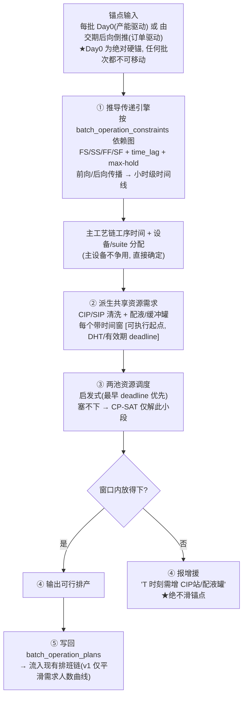
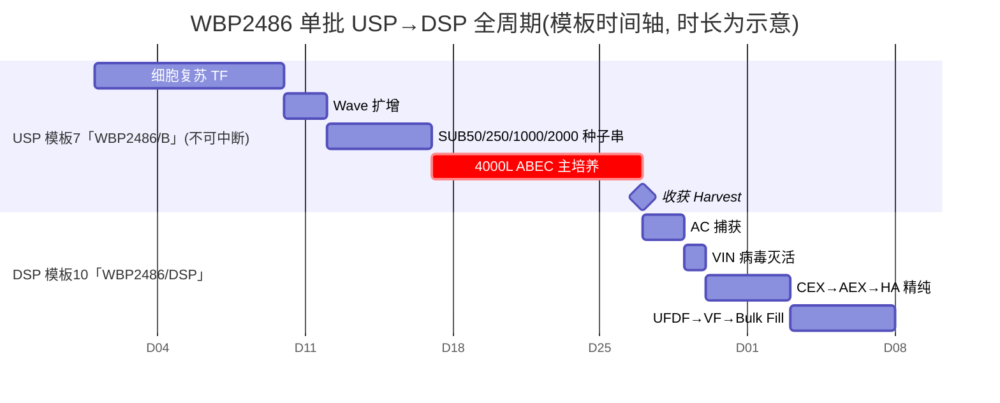

# 排产(生产排程)系统 — 需求与设计 Brief（v1）

> 状态:**需求/设计沟通阶段,未写代码**。本文件为后续推进的权威参考,随讨论更新。
> 起草:2026-06-12。配套领域文档:`docs/biopharma-cmo-domain.md`、`docs/biopharma-cmo-rules.md`、`docs/scheduling_principles.md`、`docs/WBP2486_DSP_Process_Flow.md`。
>
> **⚠️ 本文已整体作废(仅作背景留档,请勿引用其任何具体结论)。** 当前权威 = **`10_process_flow_model_spec.md`(v0.2)+ `40_scheduling_layer_spec.md`**。
> 以下旧结论均**已被取代**:§2 流程图的"或由交期后向倒推"(现为 **只正排、Day0 由 TAT 固定**)、§5 系统形态(现见 40_)、§9 "站在 V3 之上扩展"(现为 **独立新模型 + 独立 DB + 不基于 V3**)。
> 方向已定:声明式 **"操作 = 前置需求 + 后置产出" + 反向链自动派生**;只编排主工艺链。

---

## 1. 背景与定位

本系统现状:**排班(人员排程)已成熟**(solver_v4 + 在建 solver_v5),**排产(生产排程)几乎纯手动**——规划员手动拍一个批次开始日,存储过程 `generate_batch_operation_plans` 按工艺模板的固定偏移把每道工序的时间"盖章"出来,**没有任何冲突求解**(设备双占、hold 超时、CIP/配液资源争用都不校验)。

**关键架构事实**:排产的产出(工序的 `planned_start/end`)正是排班的输入(`DataAssemblerV4` 的 `operation_demands`)。因此:

```
排产(本系统) ──产出──▶ 工序时间表+设备分配 ──输入──▶ 排班(solver_v4/v5)
     ▲ 本次新建                planned_start/end             ▲ 已成熟
```

排产是排班的**上游**,是当前缺失的那一级。

---

## 2. 核心设计判断:推导传递主干,而非全局求解器

经与业务方对齐,**不采用"造一个全局生产求解器"的重路线**,改为更轻、且对 GMP 更友好的形态:

- **主工艺链 = 确定性推导传递**。真实数据显示主工艺设备(反应器/层析 skid/UFDF…)**基本不争用**。固定锚点后,按工艺依赖图前向/后向传播即可确定整条 USP→DSP 链的工序时间与设备分配。确定性、可解释、利于 GMP CSV 验证(审计问"为何在此",答"配方规定上一步后 N 小时内")。
- **唯一需要"算"的是两个共享资源池**:① 清洗灭菌资源(CIP/SIP 站);② 配液/缓冲罐。它们规模小、问题形状统一(带时间窗的任务抢有限可互换资源池)。
- **求解器降为按需后手**:两池先用启发式(最早 deadline 优先)调度;塞不下才用 CP-SAT 只解这一小段(规模极小);再塞不下 → **报增援**,不滑锚点。

> 这一判断把工程风险压低一个量级:v1 不必从一开始就是"求解器",而是 **推导引擎 + 两池资源调度(先启发式)+ 冲突/增援报告**。

### v1 流水线



---

## 3. v1 已锁定需求

| 维度 | 决策 |
|---|---|
| 目标优先级 | 准时交付(硬交期) > 少换产/CIP > 平滑人员与公用资源。**不追吞吐最大化**。 |
| 时间 vs 资源 | GMP 下时间是硬的:撞车时只能①换候选设备 ②池内窗口重排 ③报增援。**绝不靠滑时间消解**。 |
| **Day0 锚点** | **绝对硬锚,任何批次(含非硬交期批)都不可移动**。Day0 是输入不是决策变量。 |
| 时间分辨率 | **小时级**(模型按小时/分钟;照片提取的日级数据仅作粗校验种子)。 |
| 决策粒度 | 批次开始 + **每道工序的设备/suite 分配**。 |
| 排程窗口 | 滚动地平线 + 冻结近端(已下达执行的近端 N 天不动)。 |
| 与排班耦合 | v1 **解耦**:只压平"需求人数曲线",排班仍在排产产出后照旧求解。 |
| 范围 | **USP + DSP 全链**(不只下游)。 |
| v1 硬约束 | 设备/suite 独占与容量 · 前后置 + max hold time/零等待 · 换批换产 CIP + 洁净状态(DHT/CHT)。 |
| 留后续 | 公用资源(WFI/CIP)容量约束;suite 级 pre/post-viral 隔离;QC 随机 hold 的概率建模;排产↔排班强耦合。 |

---

## 4. 领域事实与真实数据(设计依据)

### 4.1 单批全周期:USP(~40天)→ Harvest → DSP(~17天)



- **USP 工时是真实值**(复苏 6h/3人、WAVE 接种 7h/2人、4000L 接种 4h/2人、收获 3h/2人)。
- **DSP 工时多为占位 12h**(`standard_time` 被批量初始化),需用真实数据校准。
- 工序依赖图(`batch_operation_constraints`:FS/SS/FF/SF + `time_lag` + 强制/优选/建议级别)**已建好**,正是推导引擎要消费的输入。

### 4.2 真实争用画像(来自车间排产板照片提取 `outputs/downstream_schedule_*`)

DSP 单轮 9/17–9/29 的逐日任务结构(真实)。**主工艺设备不成为瓶颈;瓶颈是 CIP/SIP 与配液罐**:

| Day | 总任务 | 工艺 | CIP | SIP | CIP/SIP | UFDF/Bulk |
|---|---|---|---|---|---|---|
| Day0 | 2 | 0 | 1 | | | |
| Day1(Harvest) | 32 | 29 | 1 | | | 1 |
| Day2 | 42 | 42 | | | | |
| Day3 | 46 | 25 | 6 | | 5 | 4 |
| Day4 | 34 | 19 | 4 | | 3 | 6 |
| **Day5** | 29 | 8 | **8** | | **8** | |
| Day6 | 12 | 1 | 3 | 4 | | |
| Day7 | 9 | 0 | | 5 | 2 | 1 |
| Day8 | 13 | | | 1 | | 11 |
| Day9 | 24 | | | | | 22 |
| Day10(Harvest) | 30 | 29 | | | | |

- **CIP/SIP 在 DSP 中段(Day3–7)成簇爆发,Day5 达 16 个清洗事件**——印证"下游和培养抢 CIP 站"。
- 出现**两个 Harvest(Day1/Day10)**,说明多轮批次交叠。
- **人力**:8 个班组(A–H)、每组 11 人,逐日上岗,峰值日 ~7 组同时(~77 人),曲线很尖 → 平滑诉求真实存在。

### 4.3 真实资源主数据(已导入 DB,`resources`/`resource_nodes`)

- **USP**:Room 1510;反应器 ABEC1(单次性 SUS)、BR-101(不锈钢 SS);种子反应器 20L/50L/250L/1000L/2000L。
- **DSP**:储罐 T1810(3000L)/T1812(15000L)/T1813–T1815;AKTA 层析 skid 1850/1851 + 层析柱;UFDF skid 1853(30m²);转料单元 U1850–U1853;**缓冲/配液罐 BH17xx(POU A/B)** ←即"配液罐"瓶颈。

---

## 5. 系统形态与集成

- **新建独立 `production-scheduler` 服务**,仿 `solver_v4/v5` 形态(Python + Flask/OR-Tools、独立端口、后端新增独立 DataAssembler 组装请求)。
- 产出 = 工序的小时级时间 + 设备/suite 分配 + 共享资源(CIP/配液)调度 → **写回 `batch_operation_plans`** → 自然流入现有排班链。
- **全程不碰 V4**,沿用 solver_v5 的"只增量、A 轮回归"纪律(见 `docs/solver_v5/`)。

---

## 6. 第 0 步:数据前置(任何引擎都绕不开)

推导引擎要跑出真实小时级时间线,以下数据必须先补齐(真实种子大多已在仓库,以下为"待结构化入库"):

1. **真实工时**:DSP `standard_time` 现为占位 12h → 用 `outputs/` 照片提取 + 业务校准。USP 工时已较真实。
2. **工序↔设备绑定**:`operation_resource_requirements`(某工序要哪类资源/几台/独占/CIP分钟)与 `operation_resource_candidates`(具体可用哪几台设备)**两张表均为空**,后者 DataAssembler 还未查。需录入或从 `outputs/` 矩阵反推。
3. **USP↔DSP 交接**:模板7 与模板10 当前**无连接**;需建 harvest→AC 的前后置约束 + 收获后到 AC 启动的 hold time。
4. **USP 连续性**:`is_continuous` 字段已存在但未填;需对 4000L ABEC 主培养等不可中断段置位。
5. **CIP/配液时间窗语义**:`prep/changeover/cleanup_minutes`、DHT/CHT、料液有效期(24–72h)目前"有列无逻辑",需接入推导/两池调度。

> **真实数据种子**:`outputs/downstream_schedule_20260511/` 与 `outputs/downstream_schedule_extract_20260511/`(车间排产板照片 IMG_1324/1325 的 OCR 重建:资源×日矩阵、CIP/SIP 逐日计数、A–H 人力组)。上游 USP **暂无**对应照片提取,如有原始板/Excel 可补。

---

## 7. 开放问题(待业务确认)

1. **Day0 由谁定**:产能批由规划员/campaign 节拍定,订单批由交期后向倒推——确认这两种来源的具体口径。
2. **两个固定 Day0 的批次若在 4000L ABEC / 种子串上硬冲突**(都不能移),系统报增援由人改需求,确认此升级路径。
3. **DSP 真实工时来源**:照片提取是日级,小时级工时从何校准(原始 Excel?工艺 SOP?)。
4. **批次间隔**:USP 主反应器占用 ~40 天,下一批 Day0 最早何时可起(影响产能节拍)。

---

## 8. 推进阶段建议(非承诺,供讨论)

- **P0 数据地基**:补齐第 6 节数据(工时/绑定/交接/连续性),并把 `outputs/` 真实排程结构化为基线。
- **P1 推导引擎 + 资源叠加**:前向/后向传播出小时级时间线 + 设备分配;把时间线铺到设备/CIP/配液日历上做**冲突检测**(此时已能替代手动盖章并暴露隐藏冲突)。
- **P2 两池调度 + 增援报告**:CIP/SIP 与配液罐的窗口内启发式调度;无解则定位瓶颈 + 增援建议。
- **P3 按需 CP-SAT**:仅当两池启发式在高争用片段失效时引入;以真实争用度(P0 量化结果)决定是否需要。
- **P4 人员曲线平滑**:把"需求人数曲线"作为软目标接入,削峰填谷,降低排班无解概率。

---

## 9. 重大核实更新(2026-06-12,多 agent 对抗式核实)

经深度核实(含对抗式证伪),**修正前文若干判断**——用户描述的"前置条件链"模型**已有相当部分被实现**,藏在活跃模块 **V3 bioprocess** 中:

| 链条的边 | 现状 | 证据 |
|---|---|---|
| 工序前后置(+提前量) | **已有传播引擎** | `constraintValidationService.ts` 用 EST/LST 在 FS/SS/FF/SF + `time_lag`(支持负=提前量)上传播;`lag_type` 已扩到 ASAP/FIXED/WINDOW/COOLING/**MAX_HOLD/ZERO_WAIT** |
| 物料 + 有效期 | **V3 已脚手架(非空白)** | `v3_material_state_segments`(prepared/in_hold/expired/…)+ `v3_trigger_rules.target_material_state` + `metadata.hold_window_hours`;`v3BioprocessService` 据此生成 `MATERIAL_HOLD_RISK`。真实例 `MEDIA_FILL_PACKAGE` hold_window=24h。**(前文称"缺口"有误)** |
| 设备状态 | **V3 已建状态机骨架** | `v3_equipment_state_segments` 九态(…dirty_hold/cleaning_cip/sterilizing_sip/clean_hold…)+ 操作包 `SS_CIP_SIP_PACKAGE`(PRE_RINSE→CIP→SIP→clean_hold)/`SUS_BIOREACTOR_SETUP`;投影报 `STATE_GAP`。**缺 DHT/CHT 过期倒计时(确认缺口)**,且 segment 仅写不读(投影内存判定后存档,非强约束) |
| USP↔DSP 交接 | **已存在(前文称"无连接"有误)** | `mfg_template_packages`+`mfg_template_package_day_links`:真实数据 模板7(USP)→**模板27**(WBP2486_DSP_TAT9),`收获Day32→AC C1 Day1, lag0`;`mfgTemplatePackageService.computeModuleOffsets` 已算跨模板偏移 |

**真实锚点(用户例子的真数据)**:`OP-00048「4000L ABEC培养基灌注」standard_time=4h / 3人`;邻接 OP-00050 接种(4h/2)、OP-00051 收获(3h/2);核心资质 203(MFG-Bioreactors ABEC);prep 类 OP-00046~00049 即装袋/反应器准备一带。

**配液/培养基配制**:独立模板 PT-00008「Media WBP2486」(18 个 PREP 操作)、PT-00009「buffer」(99 操作);操作类型 BUFFER_PREP/MEDIA_PREP/REAGENT_PREP;经 `batch_share_groups` 与消耗工序("4000L ABEC培养基灌注 ↔ 电极安装"等)做队伍级协调。

**V3 的真实定位**:活跃模块(近期大量提交:V3 编辑器、甘特拖拽、资源绑定 PRIMARY/AUXILIARY、阶段管理),路由 `/api/v3/bioprocess`、页面 ProcessTemplatesV3。**但它当前是"模板/配方层"的「编辑 + 投影 + 风险标记」,不是"生产批次层"的调度器/求解器。**

### 设计方向重定(待业务确认)

排产 v1 大概率应**站在 V3 模型之上扩展**,而非另起:
1. 把 V3 的"前置条件链投影"从**模板层**推进到**生产批次层 × 真实设备实例 × 日历**;
2. 补上 V3 没有的**消解层**:两池调度(CIP/配液)+ 设备实例分配 + 无解则增援;
3. 补 **DHT/CHT 过期数学**(确认缺口)与设备实例绑定(`operation_resource_candidates` 仍空);
4. 复用已存在的 `mfg_template_packages` 做 USP→DSP 跨模板锚定。
