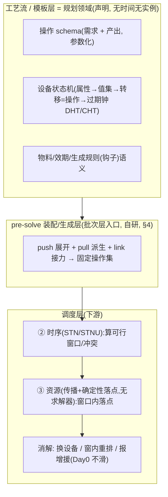

# 工艺流模型规格(Process Flow Model Spec)v0.2

> 状态:**草案 / 持续迭代(边写边改)**。排产系统"工艺流模型层"的权威设计文档。
> v0.2(2026-06-13):并入多 agent 缺口审计(36 真缺口)的处置 + 用户对关键岔路的拍板。变更摘要见 §0。
> 上游背景见 [`00_design_brief.md`](00_design_brief.md)(其 §5/§9 已作废);领导版见 [`01_executive_overview.md`](01_executive_overview.md);走查见 [`20_wbp2486_walkthrough.md`](20_wbp2486_walkthrough.md);领域见 `docs/biopharma-cmo-domain.md`、`docs/biopharma-cmo-rules.md`。
> 协作:Claude=PM 起草;用户=客户+PM 评审拍板。
>
> ⚠️ 范围:本文只规定**工艺流/模板层(规划领域)**。批次实例化、真实设备分配、跨批争用调度属下游"排产/调度层",本文只给接口。

## 0. v0.2 变更摘要

- **§3.7** 生成规则加第四种钩子:**计次重复**(循环 N 次,如 AC Cycle 1-4)。
- **§3.3** 加 **DHT/CHT 的时序(max-lag)机制** + **Suite 互斥/防交叉污染** + 状态空间膨胀克制清单。
- **§3.1/§3.4** 加 **不可中断属性**、**资质多维对象 + 更衣(gowning)时间**、**多产出的条件/优先级择一**。
- **§3.2** 明确**令牌/分装生命周期**与**数量分层**(固定量→模型层,灵活/跨批攒料→批次层)。
- **§3.6** 加 **STNU contingent(实际时长不可控)参数**;不可中断块整体平移。
- **§4** 明确 **pre-solve 装配层三步(push/pull/link)** + **迭代收敛(固定点+成环检测+预算)** + **去重/coalescing** + **叶子终止**。
- **§12** 新增:36 条缺口处置表(改/缓/废)。决策记录补 D10–D16。

---

## 1. 目标与定位

把生产排程从"人工录入每道工序的时间"升级为"**人只编排主工艺链,辅助操作(CIP/SIP/配液/装袋…)由引擎自动派生**"。

- **独立新模型 + 可独立数据库**;不基于 V3、不与现有人员求解器(solver_v4/v5)耦合。
- 范式:操作声明 **前置需求(demands)+ 后置产出(effects)**;引擎用**目标回归**自动补全辅助操作。≈ 带时序、资源容量、易腐令牌的 PDDL/STRIPS 规划域。
- GMP 红线:时间硬约束不可妥协;冲突不靠滑时间消解,而是换资源/报增援;一切可解释、可人工干预。

---

## 2. 分层架构(domain / problem 两分)



**为什么派生只能在批次层:** "要不要派生 CIP"取决于"设备此刻是否已 clean"。目标回归是**状态依赖**搜索,模板层无"当前状态",故模板层只提供动作 schema,不展开(= PDDL domain/problem 切分)。

---

## 3. 核心概念模型

### 3.1 操作(Operation)

前置需求与后置产出对称;主链与辅助同构(唯一区别 `kind`)。

```
Operation <名称> [参数: 设备类, 物料类型, …]
  kind:            PRIMARY(主链人编) | DERIVABLE(引擎派生)
  duration:        { planned, contingent_range? [x,y] }   # 实际不可控时长用区间, 见 §3.6
  interruptible:   true | false                            # false=不可中断, 整块平移(USP 培养)
  cycles?:         N                                       # 可选: 本操作循环 N 次(见 §3.7 计次重复)
  demands(前置需求):
    material  { type, qty(=fixed|batch), state_predicate, 须在效期内 }
    equipment { class, state_predicate, occupy, role, suite_role? }   # suite_role: pre_viral|post_viral|neutral
    labor     { count, qualification }                     # qualification 见下
    utility   { type, rate }                               # WFI/CIP 公用(容量约束在资源层)
  effects(后置产出):
    produce_material   { type, qty(=fixed|batch), birth_state, shelf_life }
    set_equipment_state{ attribute, value, clock? }        # clock=CHT/DHT, 见 §3.3
    consume_material   { lot_ref / type+qty }
  zone_transitions?: [...]   # 跨洁净区 → 自动插入 gowning(更衣消毒)前置延迟, 类似装袋的派生
```

- **资质 qualification = 多维对象**(非单串):`{ skill, cleanroom_level(A/B/C/D), valid_until, … }`。
- **更衣(gowning)**:操作若跨洁净区(如进 A 区/post-viral),自动插入更衣消毒时长(~30min)为前置——排产必须预留,否则人力峰值虚低、与排班对不上(喂 solver_v4/v5 的 planned_start/end)。
- `state_predicate`:SUS 反应器 `ready := 袋=installed`;SS 容器 `ready := 洁净=clean ∧ 灭菌=sterile`。

### 3.2 物料(Material)

- **令牌/批次级**:每次产出一个**物料令牌(lot)**:`{id, type, qty, 出生, 过期, 占用者}`。
- **分装(aliquot)= 配液的产出效果**(非独立操作):大批令牌(`material_lot`)按规格切出**子令牌**(`material_lot_aliquot`,如 2000L 酸 → 4×500L);**子令牌继承大批的效期**;父子关系与占用/释放显式记录(生命周期细节见 §9)。
- **数量分层(用户拍板)**:
  - **已知且确定的量 → 模型层**(如 4000L 培养基灌注消耗 4000L、固定配方用量)。`qty = fixed`。
  - **灵活的量 → 批次层**(长效期、可复用、分装后一部分**攒到下批用**)。`qty = batch`。**跨批攒料 = 攒批 campaign**(已定,见 `40_spec §10`):大令牌分装、单次使用、`scope ∈ {限本批 / 跨多批}`;**最小数量账**(余量扣减、别领超)+ 跨批效期 max-lag;由"物料需求单闸"承载、人确认冻结。酸碱清洗剂 + 长效缓冲同套。
- 效期 = `出生 + 配方常数`(默认),操作后人工回填实际(§6)。**效期落地为 min+max lag(§3.6),超期=时序不可行**。
- **令牌驻留 + 设备连续占用(在位物料):** 令牌可"**驻留**"于某设备实例(如培养液在反应器 X)。**凡操作该驻留令牌的工序自动绑定同一实例**;实例在驻留期**独占、不可中途换**(接种后每日取样/补料必须在同一台);实例在驻留**起点选一次**。→ 调度层的"**换设备**"消解杆只对 **transient/共享资源(CIP 站、配液罐)** 或**占用起点**有效;驻留中的主设备不可换。

### 3.3 设备与状态机(Equipment & State Machine)

- 设备状态 = **多属性状态向量**,每属性一条独立时间线;属性集**用户按设备类自配**(洁净/灭菌/装袋/温度/维护…),**模板预置 + 自定义 + 可保存复用**。
- 每属性 = 小状态机 `{值集, 转移边=操作, 过期钟}`;转移边可挂**跨属性前提**。属性有**三类**:**离散状态**(洁净 clean/dirty)、**计数/消耗**(用量累加 + 上限,如树脂寿命 = N 个 cycle,每用一次 +1,达上限作废)、**日历过期钟**(CHT 类时间)。
- **树脂柱 / 层析填料示例(跨批持久 + 计数寿命 + 产品绑定):** 装好的柱子 = 一台**跨批次持久**的设备实例,状态多几条:洁净/灭菌、**产品绑定**(当前归哪个项目)、**树脂寿命**(计数 N cycle + 日历)、**性能**(可人工标)。层析步骤的需求 = `已装柱 ∧ 在寿命 ∧ 洁净灭菌 ∧ 绑当前产品`;**换柱/装柱是 DERIVABLE 操作**(消耗 树脂+装柱站+人 → 产出"新柱":寿命清零、绑当前产品)。用户四情形 = 同一**按需 pull 派生**,只是"需求满足不了"的原因不同:还好就**不派生**(不是每批都装)、产品不匹配(切项目换)、寿命/日历超限(到效期换)、人工 pin"性能不行"(觉得不好手动换)。

```
EquipmentClass 反应器(ABEC, SUS):           # 一次性: 换袋即复位, 无 CIP/SIP
  attr 袋: {无袋, installed, used}   无袋─(装袋)─▶installed─(投产)─▶used─(换袋)─▶installed
  ready := 袋=installed
EquipmentClass 配液罐/层析 skid(SS):           # 才有 CIP/SIP + DHT/CHT
  attr 洁净: {dirty, clean}  dirty─(CIP)─▶clean   [CHT]; clean─(投产)─▶dirty   [DHT]
  attr 灭菌: {未灭, sterile} 未灭─(SIP)─▶sterile  [前提 洁净=clean][有效期]
  ready := 洁净=clean ∧ 灭菌=sterile
```

- **DHT/CHT 落地为 max-lag(v0.2 补)**:
  - **CHT(洁净有效期)**:`clean`/`sterile` 令牌带"过期时刻";其消费操作的开始 ≤ 过期时刻 = 一条 **max-lag**(超期→须重洗/重灭)。
  - **DHT(脏停放)**:设备变 `dirty` 后,"必须开始 CIP"≤ dirty 时刻 + DHT = 一条 **max-lag**(超期→违规)。
  - ⇒ DHT/CHT 与物料效期是**同一种 max-lag 数学**,统一由派生层生成、被求解器免费检测。
- **Suite 互斥 / 防交叉污染(v0.2 补,GMP 硬约束)**:
  - 设备实例带 `suite_id`(归属物理区/套间);操作需求带 `suite_role`(pre_viral/post_viral/neutral)。
  - **Suite 级互斥**:同一 suite 同一时刻不得并行 pre_viral + post_viral(资源容量=1 的占用约束);换产品→suite 级长清洗。这是**审计强约束**,违反即不合规。
- **状态空间膨胀克制清单(§11.3 守则6 细化)**:必进资源层=洁净(关 DHT)、灭菌(关 SIP);可选/后续=温度、残留等;效期用**单一 deadline**不细分多段;状态空间 > 阈值则降级为人工 pin + 投影。
- **共享清洗/配制资源:拓扑与占用语义(v0.3 补,业务澄清):**
  - **CIP 站 = 一组独立资源、跨部门共用、每站容量 = 1**(同一时刻只洗一条管线,排队)。拓扑三层:**设备/罐 → 挂某条管线 → 该管线绑定 {主站, 备站}**;一道 CIP 的候选资源 = 它管线的 **主站(优先)**,备站仅应急。⇒ "下游 vs 培养抢 CIP" = **两条管线共用同一主站**时抢那个站的时间轴。
  - **配液罐 = 配制期短占 + 转储释放**:溶液配好后**转移到储袋/储罐**(一道 DERIVABLE 转移操作:消耗 人 + 短占管线 → 产出"储存态令牌"),**腾出配液罐**;配液罐只占"配制 + CIP"那几小时。**配液罐数量充足 → 通常不是瓶颈**;溶液在效期内占的是**储存容器**。**真正"有时不够"的具体资源(CIP 站 / 储存容器 / 某规格罐)= 待业务点定(`40_spec §9`)。**
  - **房间(Room)= 一类设备 + 放行状态机(补缺,审计):** 房间是带状态机的设备实例 —— `attr 放行: {未放行, released}`,`未放行─(房间放行操作:清场/环境监测/QA放行)─▶released [CHT 洁净有效期]`。**"房间放行" = 产出 `released` 态的 DERIVABLE 转移操作**(与 CIP 同机制),被"操作需求:房间=released"拉动派生 → 补上目标回归对房间的 producer / 叶子,避免回归不终止。

### 3.4 需求(Demand)— 消费方拥有

- 由**使用方**声明,只声明"**目标**"(要什么物料态/设备态/人/公用),不点名产出方。
- 可携带:`分装规格`、`复用策略`、`数量(fixed|batch)`、`suite_role`。
- **多产出择一(v0.2 补)**:当多个操作的 effect 都满足同一目标(如 clean 由 CIP 或人工清洁达成),产出操作带 `{条件谓词?, 优先级}`;引擎按"条件满足者中取最高优先级",无条件则按声明顺序;**人工 pin 设备态可短路、不派生**。择一结果在批次层可见可改。

### 3.5 世界状态(World State)— 全局、跨批、随时间演进

- 设备跨批复用 → 世界状态**全局、随时间演进**;**争用从共享世界涌现**。每台设备一条贯穿所有批次的状态时间线;每个令牌一条生命线。
- **构造时间语义(v0.2 明确)**:给某批规划时的"初始态"= 在该批锚点处,对**冻结线之前所有已下达/已排操作 effects 的投影快照**。**冻结窗口**= 近端 N 天已下达执行、不再重排。
- **真值 = 计划态投影(默认)+ 人工维护层(覆盖优先)+ 必备人工干预入口**。

### 3.6 时序关系(Temporal Relations)— 钉子与弹簧

时序不是 PDM 的 FS/SS/FF/SF + 定长 lag,而是一张**柔性时序网络**:

- **钉子(nail)**:少数操作钉到(近似)绝对时刻,**可多个**(Day0/收获/交期/班次/维护窗)。
- **弹簧(spring)**:钉子间操作只受约束;**落点是调度决策**(按资源择优),不预钉死。
- 关系 = **(参照, 窗口[min,max]或中心±可单边, 粒度{小时/日历日/每日时刻}, 重复, 软硬)**。FS/SS/FF/SF 为退化特例。
- 形式 ≈ **STN**:传播得每操作 `[最早,最晚]`,负权回路=冲突(可定位、可解释)。
- **STNU contingent(v0.2 补)**:实际时长不可控、事后才知 = contingent 边 `(A,x,y,C)`(`duration.contingent_range`);区分**可控边(计划定)**与**不可控边(工艺/自然定)**;计划态用名义值,**效期类 max-lag 不可贴边排,要留 buffer**(否则实际一拖即不可行→连锁重排);动态可控性(DC)是"计划+实际回填在线重排有保证"的判据。**[v0.3 分阶段,D23]** v1 用 **STN 标称值**计算(contingent 边 day-1 进 schema 但**不跑 DC**);**DC / 动态可控留 v2 叠加**(理由见 §11)。
- **不可中断块(v0.2 补)**:`interruptible=false` 的操作(USP 14–21 天培养)= 一根刚性长弹簧,内部无空隙、**整块平移**;下游瓶颈若要改其锚点而它不可中断 → 直接升级"报增援/无解",不试图局部重排。
- **主链=墙,派生只填缝(v0.3 补,不可违反的不变量):** 主链(钉子 + 其 hold 窗)**先排定并冻结**,派生层是**严格下游的第二遍**,只能占主链留下的空隙、**无权重开主链**。某派生必需(如"先洁净"的 CIP)塞不进 → **引擎绝不偷偷挪主链那颗钉,而是报增援**,由人决定加资源或显式改主链。等价于"Day0 不滑"升格到整条主链。落点目标(派生节点双侧缓冲最大化 + 解耦遏制涟漪)详见 `40_spec §6.1`。
- **安全系数=涌现量,非手填(v0.3 修订):** 不再让人猜一个安全裕度数字;人只喂 **① contingent 边 + 范围 ② 效期硬墙 ③ 一个全局旋钮(解耦优先 / 肥窗优先,默认偏解耦)**,引擎用"**时序解耦 + 启发式 slack 分配**"(多项式)把派生落点摆到甜品区(既不贴效期、也不贴主链钉),且可解释。"过高安全系数反致过期"由此天然规避。**[精度更正]** 可**证明最优**的柔性/裕度分配是 **MIP**(Meng et al. 2015),我们**不做**、取解耦+启发式 ——"**够稳、非可证最优**"(与资源排序同属近似)。

### 3.7 组合:包与生成规则(钩子)

工艺流**不是静态操作清单,而是一套"生成规则"**:操作被规则挂到钉子+弹簧上;**钉子一动,操作自动重生成**(培养天数变→取样次数变;TAT 9/11 自适配)。

**包(Package)= 编排便利,非语义必需**:可命名、可复用的操作组(如"反应器前期准备 = 装袋+完整性测试+电极安装");展开即普通操作串;无包也能逐个串;不挑内容。

**四种钩子(把操作挂上结构的规则),都喂给 pre-solve 装配层(§4),触发方式不同:**

| 钩子 | 触发 | 例子 | 本质 |
|---|---|---|---|
| **跨度/重复(push·日历)** | 几何:绑某段弹簧按周期 | 接种→收获每日取样(±窗),跨度变→次数变 | 沿弹簧展开 N 个,N=跨度÷周期 |
| **计次重复(push·计次)** ★v0.2 | 计数:参照操作 × N 次 | AC Cycle 1-4、层析多循环 | 展开 N 个操作(N=cycles,改 N 即改循环数) |
| **需求拉动(pull)** | 缺口:需某物料态/设备态 | 配液/CIP/装袋 | 目标回归派生(§4) |
| **主链接力(link)** | 端点:链终点接链起点 | USP 收获→DSP AC | = 收获产出物料令牌被 AC 消费(pull)+ "收获后 ≤X h 进 AC"时序;**= pull+时序,非独立机制** |

> 两种生成机制:**几何/计次 push**(展开)与**需求 pull**(派生);link = pull 特例。全是规则、随几何自动重算。

---

## 4. 派生/装配引擎(pre-solve,批次层运行)

**两条核心:** `effects 即索引`(需求直接匹配"哪些操作 effect 产出它",不维护登记表);`设备状态机即算子图`(设备态需求沿转移边反向走)。

**pre-solve 装配层三步(v0.2 明确):**
1. **push 展开**:沿弹簧/计数生成定时与重复操作(取样、补料、循环 N 次)。
2. **pull 派生**:对未满足的物料态/设备态需求做目标回归,生成 CIP/SIP/配液/装袋/更衣等,递归(派生操作自身又有需求)。
3. **link 接力**:跨链/跨模块端点 = 物料令牌 pull + 时序约束(统一为 1+2 的组合)。

```
function 派生(目标需求 D, 需满足时刻 T, 世界 W):
  if W 在 T 已满足 D / D 是可采购原料(叶) / D 被人工 pin:  return []   # 终止于叶
  P ← 匹配 D 的产出操作(effects 索引)→ 按 条件/优先级 择一(§3.4)
  排 P 满足窗:物料 完成∈[T−shelf_life, T];设备态 完成≤T 且效果在 T 未过期(CHT)
  for nd in P.demands: 派生(nd, P.start, W)                            # 递归
  把 P.effects 投影进 W
```

**迭代收敛(v0.2 补):** 派生①↔资源③会相互反馈;定义:
- **固定点**:第 k 轮相比 k−1 无新操作 → 收敛,进入时序层。
- **成环检测**:维护"派生操作→依赖"DAG,有环(如"CIP 需 CIP")→ SCC 分解、报配置错误。
- **迭代预算 K**(如 5–10);超时 → 降级启发式或报无解/增援(不静默挂起)。

**去重/coalescing(v0.2 补):** 若某 effect 已满足另一待办需求(多属性向量下一个 SIP 可能同时满足多条线),**复用同一操作不重复派生**;判定 = "目标态被现有(已派生/现况)effect 覆盖"。

**叶子终止:** 现况已满足 / 可采购原料(采购 lead-time 待定)/ 公用资源容量(资源层)/ 人工 pin。

---

## 5. 实例走查:4000L 培养基灌注(真实数据)

锚点 `OP-00048 培养基灌注 4h/3人(资质 203 ABEC)`;配液源 `PT-00008`;效期假定 24h。

```
模板层声明:
  Op 培养基灌注[反应器:ABEC(SUS)] PRIMARY 4h  interruptible=false
     demands: 物料 培养基 4000L(fixed)@(已配制∧在效期内) · 设备 反应器@ready(袋=installed) 占4h · 人 3(203)
     effects: 反应器.内容物←培养基 · 反应器.袋←used
  Op 培养基配制[配液罐(SS)] DERIVABLE
     demands: 原料(叶) · 配液罐@clean · 人
     effects: 物料 培养基@已配制 效期=产出+24h · 配液罐.洁净←dirty(DHT 起)

批次层(灌注锚定@Day0; 初始: 反应器 袋=无袋; 配液罐 洁净=dirty):
  目标@Day0: 培养基@已配制 ∧ 反应器⊨ready
   ├ 培养基@已配制 ─pull→ 配液, 完成∈[Day0−24h, Day0]
   │    └ 配液罐@clean ─走洁净线→ 派 CIP(SS) …递归(WFI/人)
   └ 反应器.袋=installed ─pull→ 装袋(SUS, 预灭菌袋, 无 CIP/SIP)
  ⇒ 自动摊开: 装袋(SUS) ‖ CIP(配液罐)→配液 → 灌注@Day0
  注: CIP/SIP/DHT/CHT 仅在 SS 设备; SUS 换袋即复位。
```

---

## 6. 计划态 vs 实际态(plan / actual)

- 每个"产出时刻/效期/状态时钟"带**计划槽 + 实际槽**;计划投影=默认真值,操作后人工回填实际,**覆盖优先**,任何时刻可人工干预。
- **回填级联重投影(v0.2 补)**:某操作 `actual_end` 一变 → 其产物/状态 deadline 按 actual_end 推算 → 检查下游 max-lag/CHT 是否仍在窗内 → 不在则标"需重排";v1 用**报冲突让人决**,v2 再加自动轻排。

---

## 7. 与下游"排产/调度层"的接口

装配层交给调度层:一组**带时间窗的操作**(主链+派生辅助)+ 它们对**共享资源**(设备实例、CIP 站、配液罐、WFI、人)的占用需求 + 时序约束(钉子/弹簧/效期 max-lag)。调度层:落实到真实设备×日历、解争用(换设备/窗内重排/报增援,Day0 不滑)、平滑人力曲线;**反馈**:可行排程 / 冲突(带可解释回路)/ 增援建议。**交接数据 schema 待细化(§9)。**

---

## 8. 数据模型草图(独立库,草案)

`operation_def`(kind, duration_planned, contingent_range, interruptible, cycles) · `operation_demand`(target 类型/谓词, qty 模式, 复用策略, suite_role) · `operation_effect`(产物料/改设备态/消耗, 效期公式, clock) · `material_type` / `material_lot`(+ `parent_lot_id` 分装) · `equipment_class` / `equipment_instance`(suite_id) · `equipment_attribute`(值集) / `state_transition`(from→to via op, 前提, DHT/CHT) · `state_machine_template` · `generation_rule`(钩子: push日历/push计次/pull/link 的参数) · `world_state_segment`(每设备每属性: 计划段/人工覆盖段) · `material_lot_event`(生命线)。**完整 DDL 待 v0.3。**

---

## 9. 开放问题 / TBD(v0.2 刷新)

1. **authoring = 双视图并持(用户拍板)**:**图/结构化视图**(语义本体:操作 + 需求/产出 + 前后置 + 生成规则)与**相对示意甘特视图**(同一模型在 notional Day0 + 名义时长上的投影;**拖拽 = 编辑底层相对约束/lag,而非绝对日期**)**并存,单一真值源 = 模型本身**。注意:甘特视图须明确标为"相对/示意"(模板无绝对时间);规则驱动/派生部分以"规则标记 / 代表性展开"呈现。**甘特视图复用 wxb-ui 的 `WxbGanttChart`**(它是设计系统组件,V3 工艺模板甘特也只是其消费者之一;Canvas 渲染、相对时间、级联/多选/撤销、1000+ 操作)——方案 = **组件零改 + 自写适配器(本模型→GanttTask)+ actions(拖拽 = 改底层相对约束/lag 并重传播,而非钉绝对位置)**,与 V3 零耦合(合 D1),约 8–11 天。UI 细节待 v0.3。
2. **QC 放行门 / 不合格返工**:v1 标记为**不建条件分支**(默认 100% 放行,返工=人工触发重排),避开 NP-hard;何时/如何引入条件分支(CSTNU 子集)待后续专题。
3. **跨批攒料/结转**:长效期、可复用、分装后留给下批的物料 → 批次层,**硬骨头**(库存/时序/权属交织)。
4. **VCD/倍增驱动升罐**(按工艺进度而非日历触发):标 **FUTURE**,v1 退化为日历估计 ± buffer,v2 接 MES。
5. **多产出条件谓词语言**(PredicateExpr 空间)与采购 lead-time:待规范。
6. **交接数据 schema**(装配↔时序↔资源三层 + 增援报告格式):待细化。
7. **去重/coalescing 形式化** 与 **设备态资源膨胀定量界**:待压测期定。

---

## 10. 术语表

| 术语 | 含义 |
|---|---|
| 操作 / 需求 / 产出 | 带前置需求+后置产出的原子;消费方声明的目标态;完成后对世界的改变 |
| 令牌 Lot / 分装 Aliquot | 一次产出的物料实例(带效期);大批切出的子令牌(继承效期) |
| 钉子 / 弹簧(STN) | 钉到绝对时刻的操作 / 受柔性约束、落点由调度定的操作 |
| 钩子 | 把操作挂上结构的生成规则:push日历 / push计次 / pull / link |
| 目标回归 | 从目标态反向搜出能达成它的操作链 |
| CHT / DHT | 洁净有效期 / 脏停放时间(设备态过期钟,落地为 max-lag) |
| Suite | 物理套间/区;互斥(pre/post-viral 不并行)是 GMP 硬约束 |
| gowning | 跨洁净区的更衣消毒前置时间 |
| plan / actual | 计划态(默认)/ 实际态(人工回填,覆盖优先) |
| STN/STNU/RTN/RCPSP-max | 形式基础,见 §11 |

---

## 11. 形式基础与分层架构(文献调研结论)

本模型 = 三套成熟形式的重组;系统分三层(§2)。

| 层 | 职责 | 形式基础 | 落地 |
|---|---|---|---|
| ① 装配(pre-solve) | 目标回归 + 钩子展开 → 固定操作集 | 无现成形式(差异化点);近似 cleaning-as-decision | 自研(§4) |
| ② 时序 | 钉子+弹簧→可行窗口;冲突=负权回路;解耦→涌现裕度;实际不可控=contingent(v2) | **v1: STN + 时序解耦**(Hunsberger 2002,多项式);**v2: STNU + DC** | 自建增量 Bellman-Ford(deltastn);DC 留 v2(无 Py 生产库→后台异步 / CSTNU-Tool 对拍) |
| ③ 资源 | 窗口内按容量收紧 + 确定性落点;与②双向迭代 | **RCPSP-max + cumulative resources**(v1 仅取其传播部分) | **自建 time-table 扫描 + 确定性窗内落点;v1 不上求解器**(CP-SAT 降为未来可选后手) |

> **[2026-06-14 修订 D19]** v1 资源层**不做求解器**,走纯传播:time-table 扫描线收紧窗口 + 确定性窗内落点(LST 紧者优先 /「此批优先」权重)+ 报增援(Day0 不滑)。理由:排产主体是传播问题,且**传播比求解器更可解释**(STN 最短路给「这步为何最早只能在 X」的因果链,GMP 占优);无现成框架同时满足「传播独立可调 + 毫秒级增量 + STN 可解释」→ 传播主干须自建,既自建就不再背求解器工程量。**求解器降为未来可选逃生口**(压测证明极密尖峰漏可行解才评估;架构已留接口:那一小段窗口+候选已是独立子图)。详见 `40_scheduling_layer_spec.md` §6。

> **[2026-06-14 STNU 路线裁决,D23 — 调研 wwyxp1sy4]** **STNU 是正确的目标形式,但分阶段。** `配制/CIP/培养` 时长事后才知 = contingent 语义,DC 是"在线重排仍合法"的**最小充分形式**;CSTNU(PSPACE 完全)/ pSTN(需概率分布)对我们**过度**。**但 v1 不建 DC**:① 无生产级纯 Python DC 库(只 Java CSTNU-Tool);② 增量 DC 有 soundness 缺陷且无验证过的 Py 实现(而交互甘特恰要增量);③ ~300 操作可能撞 DC 性能墙(实测「<0.9s」仅 55 节点,~300 任务有 2 分钟墙)。**故 v1 = STN + 时序解耦(Hunsberger 2002,多项式,给涌现裕度)+ 标称时长**;contingent 边 day-1 进 schema 但不跑 DC。**v2 叠加 STNU + DC**(把"启发式够稳"升级成"可证明动态可控",可后台异步校验、用 CSTNU-Tool JAR 对拍)。v1 走 STN 不跑 DC **正好绕开性能墙**(STN 增量传播 O(n²)、毫秒级)。

**直接采纳的映射:** 操作=需求+产出 ≈ **RTN**(物料/设备/人/公用/设备洁净-脏态 皆 resource);CIP 派生 = clean/dirty 资源平衡;**物料效期/DHT/CHT = 生产者→消费者 min+max lag**(超期=时序不可行,免费检测);设备态/库存 = cumulative resource;冲突 = 时距图负权回路(可解释);时距统一为 `S_j−S_i≥δ`。

**守则(规避坑)** [D19 后:以下凡提 CP-SAT 均指 v2/未来可选后手,非 v1]:①**v1 落点走纯传播**(time-table + 确定性窗内落点),不上离散时间 MILP;CP-SAT 仅 v2/未来后手;②派生留 pre-solve;若将来加求解器后手,只喂争用子图、不进传播主干;③效期 max-lag 留 buffer 防连锁重排;④max-lag 后判可行 NP-hard 且网络成环→SCC;⑤CIP 是隐藏瓶颈(呼应 Day5=16),建成有限共享资源;⑥设备态当资源会膨胀→克制清单(§3.3);⑦析取/条件(QC门/选设备)会跨入 NP-hard,v1 规避(§9.2);⑧两层迭代需收敛(§4)。

**关键参考:** STN/STNU/DC:Dechter 1991 · Morris-Muscettola-Vidal 2001 · Cairo-Rizzi 2017 · CSTNU-Tool(Verona)。批过程:Kondili/Pantelides 1993(STN)· Pantelides 1994(RTN)· Neumann-Schwindt(cumulative)。RCPSP-max:Schutt et al. 2013(LCG)· Laborie 2018(CP Optimizer)。不确定/重排:arXiv:2409.09107。领域:Intelligen SuperPro/SchedulePro(辅助操作业界仍人工挂→自动派生是差异化)。

---

## 12. v0.2 缺口处置表(来自多 agent 审计:36 真缺口 + 7 虚报)

**已并入 v0.2(改):** 计次重复钩子(§3.7)· DHT/CHT max-lag(§3.3)· Suite 互斥(§3.3)· gowning/资质多维(§3.1/§3.4)· STNU contingent 参数(§3.6)· 不可中断块(§3.6)· 装配三步+迭代收敛+去重+叶子(§4)· 多产出择一(§3.4)· 数量分层(§3.2)· 世界状态时间语义/冻结窗(§3.5)· 回填级联重投影(§6)· 状态空间克制清单(§3.3)。

**标 TBD / 缓(§9):** authoring(DAG vs 甘特,用户未决)· QC 放行门/返工(v1 不建分支)· 跨批攒料(批次层硬骨头)· VCD 驱动(FUTURE)· 条件谓词语言/采购 lead-time · 三层交接 schema · 去重形式化与膨胀定量界 · 完整 DDL(v0.3)· authoring UI/状态机编辑器 · plan/actual 并发一致性(v2)· 排产↔排班强耦合(联调期)。

**虚报(废,已澄清):** "V3 集成矛盾"(D1 已定独立新库,00_brief §9 已废)· "效期/USP-DSP 交接缺失"(V3 有概念,我们独立重建,缺的只是与 max-lag 接上)· "派生无 prior art=高复杂"(其实≈重发明 RTN,风险可控)· "Suite/world-state 完全无"(属需规范,非空白)。

---

## 决策记录(Decision Log)

| # | 决策 | 理由 |
|---|---|---|
| D1 | 独立新模型 + 独立 DB,不基于 V3、不挂现有求解器 | 用户拍板;V3 仅参考 |
| D2 | 声明式"操作=需求+产出",主链人编、辅助引擎派生 | 只排主链、CIP 自动冒出 |
| D3 | 派生 = 引擎目标回归搜索(非触发预编包) | 最自动 |
| D4 | 派生只在批次层展开 | 派生状态依赖,模板层无"当前态" |
| D5 | 物料=令牌级 + 分装(配液的产出效果) | 效期/占用追到实例;分装化解复用vs专用 |
| D6 | 设备态=多属性向量,用户按类自配,模板+自定义+保存 | 不同设备状态维度不同(SUS vs SS) |
| D7 | 一目标态可多产出,按条件/优先级择一;设备态可人工 pin 短路 | 灵活 + 异常逃生口 |
| D8 | 世界状态全局跨批共享;真值=计划投影+人工维护(覆盖优先) | 设备跨批复用;争用涌现 |
| D9 | 效期=计划常数+实际回填;Day0 硬锚不可滑;多锚点 | plan/actual;GMP 时间硬;弹性 |
| D10 | 形式基础=STN/STNU(时序)+RTN/cumulative(资源)+RCPSP-max(落点形式底座);三层(装配/时序/资源) | 文献调研。**[落点部分已被 D19 修订:v1 不用 CP-SAT、纯传播;CP-SAT 降未来可选后手。"派生是唯一自研"亦失准——STN/time-table/落点主干均自建]** |
| D11 | 时序=钉子+弹簧(STN),FS/SF 退化特例;实际不可控=STNU contingent | 比定长 lag 真实;计划弹性 |
| D12 | 生成规则四钩子;循环 N 次 = 计次重复钩子 | 工艺流是生成规则集;循环数随 N 自动变 |
| D13 | DHT/CHT 与物料效期统一为 max-lag;Suite 互斥=资源容量1 硬约束 | 同一数学;GMP 合规 |
| D14 | 数量:已知确定→模型层(fixed);灵活/跨批攒→批次层(batch) | 用户拍板;跨批攒料另列硬 TBD |
| D15 | QC 条件分支 v1 不建(默认放行,返工人工触发) | 避开 CSTNU NP-hard |
| D16 | 不可中断操作整块平移;装配层迭代需固定点收敛+成环检测+预算 | USP 培养不可中断;求解可终止 |
| D17 | authoring = 双视图并持:图(语义本体)+ 相对示意甘特(同模型投影,拖拽改约束非日期);单一真值源=模型 | 兼顾精确规则编辑与拖拽直观,避开"模板无时间"陷阱 |
| D18 | 设备属性三类:离散态 / 计数消耗(树脂寿命=N cycle) / 日历过期钟;换柱=按需 pull 派生 | resin 场景:跨批持久+计数寿命+产品绑定,与 CIP 同机制 |
| D19 | **v1 不做求解器,纯传播**:自建增量 STN(最短路)+ time-table 资源扫描 + 确定性窗内落点(LST/此批优先)+ 报增援;求解器降为未来可选后手(非 v1) | 技术选型调研(四路联网+综合):排产主体是传播问题、传播比求解器更可解释、无现成框架满足增量+可解释;**推翻原「用模块化 CP-SAT」** |
| D20 | CIP 站=独立资源/跨部门共用/容量1;拓扑 设备→管线→{主站,备站};引擎只排主站,满则报增援(备站=人工应急);配液罐 配制期短占 + 转储释放、通常非瓶颈 | 业务澄清;争用收敛到 CIP 站等真瓶颈,真瓶颈待点定 |
| D21 | 主链=墙,先冻结;派生严格下游、只填缝、永不反推主链(塞不下=报增援)。**[精度补 C16]** "墙"=**工艺钉子(工艺步)+ Day0**(引擎绝不自动挪);派生 CIP(含主工艺触发)是辅助、有自己 DHT/CHT 窗,**末招可在窗内微调(小影响)≠ 反推主链**(钉子没动) | 用户铁律;"Day0 不滑"升格到整条主链;钉子是钢、CIP 是带弹性的砖 |
| D22 | 落点目标=派生节点双侧缓冲最大化(柔性)+ 解耦遏制涟漪(扰动死在本地);安全系数=涌现量(人只给 contingent + 效期墙 + 解耦旋钮) | 最小扰动=可传播多项式算、无需求解器;甜品区自动(注:可证最优柔性是 MIP,我们取启发式) |
| D23 | STNU=目标形式但**分阶段**:v1=STN+时序解耦(多项式,涌现裕度)+标称时长、contingent 进 schema 不跑 DC;v2 叠加 STNU+DC(后台异步、CSTNU-Tool 对拍) | 调研 wwyxp1sy4:无 Py 生产级 DC 库、增量 DC soundness 缺陷、~300 操作性能墙;最优柔性=MIP 故取启发式 |
| D24 | **分阶段派发(料闸→时间闸)+ 攒批 campaign**:物料需求单(配/攒/量,人审改→确认冻结+版本校验)在前,任务派发在后;跨批攒料=声明 scope 的攒批、最小数量账 | 攒批省 CIP;确认提交点解掉并发盲区;GMP 物料放行同构;详见 40_spec §10 / C14-15 |
