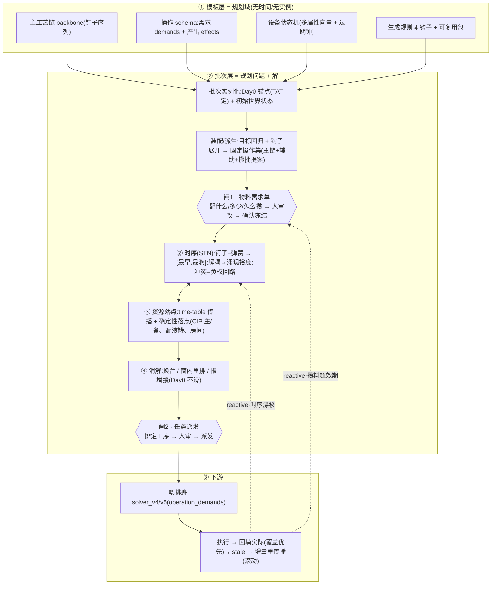

# 端到端流程主线(End-to-End Flow)v0.1

> 状态:**草案 / 主线总览**。把排产系统从 **模板建立 → 批次 → 装配 → 物料闸 → 时序 → 落点 → 任务闸 → 喂排班 → 执行回填** 串成一条可读的链。
> 起草 2026-06-14。本文是**主线/索引**;模型层细节见 `10_process_flow_model_spec.md`,调度层细节见 `40_scheduling_layer_spec.md`。决定编号 D*=模型层、C*=调度层。

---

## 0. 一句话

> 人**只编主工艺链**;系统**自动派生辅助活、算时间窗、落到真实资源**,经**两道人审闸**(物料、任务)确认后派发,产出喂给排班(solver_v4/v5)。**全程纯传播、不做求解器、Day0 不滑、主链是墙。**

## 1. 全景图

## 2. 逐阶段走查

### 阶段 0 · 模板建立(模板层 / domain,无时间无实例)
- **主工艺链(backbone)= 一串钉子**:人编排的工艺步(USP 复苏→扩增→发酵→收获;DSP AC/VIN/CEX/AEX/HA/UFDF/…/BulkFill),用**钉子+弹簧**的时序词汇(参照/窗口[min,max]/粒度/重复/软硬),非 FS/SS 死 lag。**主链只编主链**,辅助活不在这层(D2)。
- **操作 = 需求(demands)+ 产出(effects)**:声明式、对称。需求只声明"目标态"(要某物料态 / 设备态 / 人 / 公用),不点名产出方;effect 本身即索引(谁产出它)(D2)。
- **设备状态机** = 多属性向量,每属性一条状态线 + 过期钟;属性三类:离散态 / 计数消耗(树脂寿命)/ 日历过期(D6、D18)。
- **生成规则 4 钩子 + 可复用包**:push(日历/计次重复)、pull(目标回归派生 CIP/配液)、link(USP→DSP 接力);包=编排便利非语义必需(D12、§3.7)。
- **不展开、不派生**:模板层无"当前状态",派生无从谈起(D4)。

### 阶段 1 · 批次实例化(批次层 / problem)
- **Day0 锚点**:计划员给每批一个 Day0,**由 TAT 规定固定**;系统**只正排、不优化锚点、不倒排**;交期=检查线(晚于交期→告警)(C2)。
- **初始世界状态**:= 该批锚点处,对**冻结线之前所有已下达/已排操作 effects 的投影快照**(D8);跨批共享的设备/料在此可见 → 争用与攒料从这里涌现。

### 阶段 2 · 装配 / 派生(pre-solve,自研)
- **目标回归 + 钩子展开** → **固定操作集**:主链 + 派生辅助(CIP/SIP/配液/房间放行)+ **攒批提案**(D3)。
- **主链先排定并冻结 = 墙**;派生**严格下游、只填缝、永不反推主链**(塞不下=报增援,引擎绝不挪主链钉)(D21、C12)。
- **叶子条件**:目标已由世界状态现存令牌满足(含**料闸已确认、声明 scope 的攒批账面余量**[非机会主义捡料] / 可采购原料 / 设备已 clean)→ 不派生。
- 迭代收敛:固定点 + 成环检测(SCC)+ 预算 K(D16)。

### 阶段 3 · 闸 1:物料需求单(料的闸)★
- 引擎出**物料需求单**:配什么 / 配多少 / **怎么攒**(攒批 campaign:大令牌分装服务多批,确定性贪心打包)/ 原料需求 / 效期窗 / "1 次 vs N 次"经济建议(C14、C15、40_spec §10)。
- 人**审阅 / 修改**(拆攒批、改量、强制单独配、改用库存)→ **确认 = 冻结物料计划**(共享台账 + 提交版本校验/乐观锁)。
- **此闸定"能不能攒"**(靠锚点粗时间线 + 效期窗);并把"跨批并发盲区"降级成"提交点版本校验"。

### 阶段 4 · 时序(STN)
- **钉子+弹簧 → 每操作 [最早,最晚]**;冲突 = 时距图**负权回路**(可定位、可解释)(D11)。
- **效期 / DHT / CHT = 生产者→消费者 min+max lag**(超期=时序不可行,免费检测)(D13)。
- **解耦 → 涌现裕度**:时序解耦(Hunsberger 2002,多项式)让派生节点双侧缓冲大、扰动死在本地;安全系数是**涌现量**非手填(D22)。
- **v1 = STN + 标称时长**;contingent 边进 schema 但**不跑 DC**;**v2 叠加 STNU + DC**(D23、C13)。
- 增量:拖甘特 → 单边变更 → 增量 Bellman-Ford(deltastn)毫秒级重传播。

### 阶段 5 · 资源落点(纯传播,无求解器)
- **time-table 扫描线**收紧共享池(CIP 站 / 配液罐 / 房间)窗口,与时序双向迭代(C9)。
- **确定性窗内落点**:等价候选间按 LST 最紧者优先 /「此批优先」抬权重;**非全局最优但可解释、可复算**(C9)。
- **CIP 站路由**:独立、跨部门、容量 1;拓扑 设备→管线→{主站,备站};**只排主站,满则报增援**(备站=人工应急)(C10、D20)。
- **配液罐**:配制期短占 + 转储释放、通常非瓶颈;真瓶颈(CIP/储存/某规格罐)待业务点定(C11)。
- **设备连续占用**:驻留令牌绑同一实例、驻留期独占、不可中途换(C4)。
- **落点目标三准则**:①主链墙 ②派生双侧缓冲最大化 ③解耦遏制涟漪(C12)。

### 阶段 6 · 消解
- 自动次序:**换台 → 窗内重排 → 报增援**(冲突节点 + 可执行建议,决策权交人);**Day0 永不滑**(C5)。

### 阶段 7 · 闸 2:任务派发(时间的闸)★
- 排定工序 → 人审 → **派发** → 喂排班 + 冲突/增援报告(C15)。
- 料闸只在物料计划真变时重开;时间闸更频繁。

### 阶段 8 · 执行 / plan-actual / reactive
- **plan/actual**:计划态投影=默认真值;操作后人工回填实际(覆盖优先);任意时刻人可干预(D8、D9)。
- 实际变 / 计划变馊 → **标 stale → 增量重传播 + 提示重审**(滚动重排,最小扰动)。

## 3. 贯穿性概念(横跨所有阶段)

| 概念 | 一句话 | 出处 |
|---|---|---|
| **世界状态** | 全局、跨批共享、随时间演进;冻结窗近端锁定 | D8、10_§3.5 |
| **钉子+弹簧 / STN** | 主链钉死、弹簧由调度按资源落点;v1 STN / v2 STNU+DC | D11、D23 |
| **纯传播、无求解器** | 主体是传播问题;传播比求解器更可解释;求解器=未来可选后手 | D19、C9 |
| **主链是墙** | 派生只填缝、永不反推主链,塞不下=报增援 | D21、C12 |
| **Day0 不滑** | 时间维度锁死;消解只换资源/挪窗/报增援 | C2、C5 |
| **人机协作** | 自动出基线 + 双视图甘特微调;双闸人审放行 | C1、C7、C15、D17 |
| **GMP 可解释** | 每个时间窗有因果链;不可行指出冲突边;双闸=物料放行同构 | D19、C15 |

## 4. 与下游接口
- 产出写回 **`batch_operation_plans`**(工序 planned_start/end)→ 流入现有排班链(`DataAssemblerV4` 的 `operation_demands`)。
- 排产是排班的**上游**;v1 只压平"需求人数曲线"(解耦,排班照旧在产出后求解)。**注**:`operation_demands` 喂 solver_v4 时**须带 `qualification`(资质/洁净级别)且 `planned_start` 已含 gowning 前置**——"压平人数曲线"不可抹平资质维度,否则排班资质约束拿不到上游意图(10_§3.1)。
- **全程不碰 V4**;新建独立 production-scheduler 服务(仿 solver_v4/v5 形态,独立端口/独立 DataAssembler)。

## 5. 仍开放(非主线阻塞)
- **真瓶颈点定**(②):CIP 站 / 储存容器 / 某规格罐(业务一句话)。
- **落地前置**:进 schema / 完整 DDL / 排产↔排班接口冻结 / 派生压测(转 v0.3 实现期)。
- **v2+**:STNU+DC、QC 条件分支、VCD 驱动、最优 lot-sizing、真·并行规划并发。

### 5.1 落地前验证清单(整合审计 wg6vygrsk,非设计返工)
1. **中密度误报增援**(D19+D21 诚实代价):纯传播单遍 LST 在中密度争用就可能漏解 → 已补"廉价有限回溯 bounded-swap + 误报判据"(§6.2);**+ 用户 C16:CIP 优先级(主工艺>配液)+ 末招主工艺 CIP 窗内微调,多给一层余量,进一步降误报**。压测度量派生节点双侧 slack 分布,中位数近 0 则 D22 目标从"最大化缓冲"调"可行优先 + 缓冲尽力"。
2. **复杂度对账**:"毫秒级"只对**单边增量重传播**成立;双侧缓冲/解耦需全对最短路(O(n³)),time-table 由 event-point×跨度×资源池×②↔③轮 驱动 → ~300–500 操作写码前做一次粗对账,其余标"需压测"。
3. **②↔③ 终止性**:time-table 传播单调收窄,但"确定性落点提交"是贪心 commit,可能 placement thrashing → **已由 C16 化解:按固定优先级(主工艺 CIP 先)增量插入,每步逼定、最后一步无自由度 → 天然终止不震荡**(固定优先级打破"谁最紧"拉扯)。仍建议给迭代预算 + 震荡检测作兜底,超预算报增援不静默循环。
4. **效期硬 buffer 强制**(v1 STN 标称时长):带 contingent 来源的 max-lag **强制 buffer ≥ (contingent 上界 − 名义值)**,作为 `contingent_range` 自动派生的硬下界(非人手填)。裕度分两类:**效期硬 buffer(强制)+ 解耦柔性 slack(尽力)**。
5. **write-skew 并发**:乐观锁只挡同记录并发写,挡不住"两人各攒同种碱液、改不同攒批单但叠加超量" → 版本校验粒度落到**被共享的资源/物料账本身**(碱液最小数量账/储存容器/CIP 承诺表),最小数量账用"提交时增量扣减 + 余额非负校验"。§9.5 从"已解决"诚实降为"已缓解,write-skew 需账级校验"。
6. **攒批跨批 nervousness**:跨批 max-lag 配死区/阻尼(拖延 < 剩余 buffer 只更新不标 stale);限重审半径(只动未派发批,已派发攒批承诺冻结、报人工)。
7. **料闸→时序接口 schema**:定义冻结物料计划交给时序层的字段(哪 lot/aliquot 服务哪批哪 demand、效期窗→max-lag、余量、scope)——三层交接 schema(落地期)。
8. **USP 驻留段零自由度**:区分"驻留绑定型派生(落点几何固定,不参与 slack 分配)" vs "自由填缝型(CIP/配液/房间,才是双侧缓冲/解耦对象)",避免对零自由度节点空跑落点优化、稀释裕度统计。

## 决策映射(主线 → 决定)
| 阶段 | 关键决定 |
|---|---|
| 0 模板 | D2 声明式 / D4 只批次层派生 / D6 状态机 / D12 钩子 / D17 双视图 |
| 1 批次 | C2 Day0/TAT / D8 世界状态 |
| 2 装配 | D3 目标回归 / D16 收敛 / D21 主链墙 |
| 3 料闸 | C14 攒批 / C15 双闸 / D24 |
| 4 时序 | D11 STN / D13 max-lag / D22 解耦涌现 / D23 STN→STNU |
| 5 落点 | C9 纯传播 / C10 CIP 路由 / C11 配液罐 / C12 落点目标 |
| 6 消解 | C5 / Day0 不滑 |
| 7 任务闸 | C15 |
| 8 执行 | D9 plan/actual / stale 重传播 |
